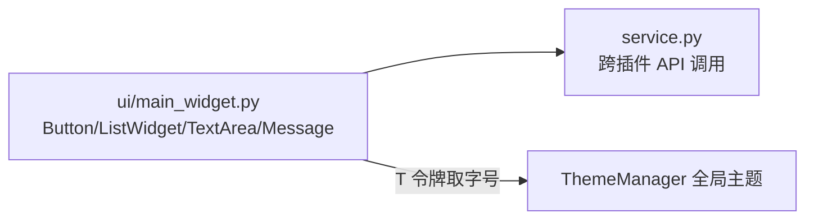

# SPEC：api_demo UI 迁移至 InstructionX_UIKit

- **创建日期**：2026-07-29
- **修改日期**：2026-07-29

## 1. 技术方案与设计决策（Why）

| 决策 | 理由 |
|---|---|
| 整体删除插件 QSS（`style/main.qss`） | UIKit 组件默认样式 + 全局主题已覆盖全部控件样式并自动跟随亮/暗主题，插件级 QSS 与 `class="heading"/"muted"/"subtle"` 属性选择器随之失效 |
| 删除 `entrance.py` 的 `get_widget` 主题缓存覆写 | 该覆写仅为在旧 style_qss 主题切换时重建 Widget；UIKit 全局主题实时生效，无需重建 |
| 标题用 `QFont` + `T("font.lg")` 而非 QSS | 禁止硬编码字号；令牌随主题实时生效（与 color_converter 模板一致） |
| `Button(variant="primary")` 承载主操作「执行 API 调用」 | UIKit 语义：主操作使用 primary 变体；辅助操作（刷新/查看）用 default 变体 |
| `QMessageBox.warning` → `Message.warning(self, text)` | 统一使用 UIKit 轻提示，避免阻塞式原生弹窗 |
| 版本号 release.1.0.0 → release.1.1.0 | UI 重构属功能层面改进，升级小版本 |

## 2. 控件映射

| 原控件 | 新控件 |
|---|---|
| `QPushButton`（刷新/查看所有 API/查看 Tools，class="subtle"） | `Button(text, variant="default")` |
| `QPushButton("执行 API 调用"，class="primary")` | `Button("执行 API 调用", variant="primary")` |
| `QListWidget`（API 方法列表） | `ListWidget()`（统一行高，`SelectionMode.SingleSelection` 保持） |
| `QTextEdit`（输入参数） | `TextArea(placeholder=...)` |
| `QTextEdit`（调用结果，只读） | `TextArea()` + `setReadOnly(True)` |
| `QMessageBox.warning` ×2 | `Message.warning(self, text)` |
| `QLabel` 标题（class="heading"） | `QLabel` + `QFont(T("font.lg"), Bold)` |
| `QSplitter` | 保留不变 |

## 3. 数据流向

## 4. 涉及修改的文件

- `ui/main_widget.py`：UIKit 迁移（删除样式加载样板，控件替换）；
- `entrance.py`：删除 `get_widget` 主题缓存覆写（含函数级 `utils.style_qss` 导入）；
- `information.py` / `IXPlugin.json`：version → `release.1.1.0`；IXPlugin.json description 重写为简洁中文；
- 新增：`docs/req/2026-07-29/PRD-api-demo-uikit-20260729.md`、`SPEC-api-demo-uikit-20260729.md`；
- 删除：`style/` 目录、`__pycache__`。

## 5. 验证

项目根运行 `.venv\Scripts\python.exe temp\verify_batch1.py api_demo`（离屏实例化插件、创建主控件、亮/暗主题切换各一次）必须 PASS。
