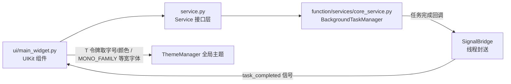

# SPEC：background_task_demo UI 迁移至 InstructionX_UIKit

- **创建日期**：2026-07-29
- **修改日期**：2026-07-29

## 1. 技术方案与设计决策（Why）

| 决策 | 理由 |
|---|---|
| 整体删除插件 QSS（`style/main.qss`） | 其选择器 `QLabel[heading="true"]`/`QLabel[muted="true"]` 为无前缀全局选择器，会污染宿主应用所有 QLabel，本就不合规；UIKit 组件默认样式 + 全局主题已覆盖全部控件样式并自动跟随亮/暗主题 |
| 标题用 `QFont` + `T("font.lg")`，UUID 标签用 `QPalette` + `T("color.text.secondary")` | 禁止硬编码字号/颜色；令牌随主题生效 |
| `Button(variant="primary")` 仅用于主操作「创建任务」 | UIKit 语义：主操作使用 primary 变体，其余操作（取消/刷新/清理）使用默认变体 |
| 日志区 `TextArea` 设置 `QFont(MONO_FAMILY)` | 日志时间戳前缀等宽对齐便于阅读；`MONO_FAMILY` 从 InstructionX_UIKit 顶层导入 |
| `QMessageBox`→`Message.warning(self, text)` | UIKit 轻提示替代模态弹窗，风格与全局一致且不阻断操作 |
| 状态图标改用语义化 Unicode 符号 | 原字典值全为 `"?"` 占位（原始字符已丢失），按状态语义恢复：⏳/▶/✅/❌/⏹ |
| `_create_task` 拆出 `_create_task_by_type` 分发方法 | 控制函数行数 ≤20 行，仅拆分 UI 调度、不改业务逻辑 |
| 版本号 release.1.0.0 → release.1.1.0 | UI 重构属功能层面改进，升级小版本 |

## 2. 控件映射

| 原控件 | 新控件 |
|---|---|
| `QPushButton("创建任务")` | `Button("创建任务", variant="primary")` |
| `QPushButton`（取消选中任务/刷新/清理已完成） | `Button(...)`（默认变体） |
| `QListWidget`（任务列表） | `ListWidget()`（统一行高，沿用 `QListWidgetItem` + `UserRole` 存任务 ID） |
| `QComboBox`（任务类型/状态筛选） | `ComboBox(items=[...])` |
| `QLineEdit`（任务名称） | `LineEdit(text="测试任务", placeholder=...)` |
| `QSpinBox`（执行时长/间隔） | `SpinBox(minimum=..., maximum=..., value=...)` |
| `QCheckBox("启用")` | `CheckBox("启用", checked=True)` |
| `QTextEdit`（执行日志，只读） | `TextArea()` + `setReadOnly(True)` + `setFont(QFont(MONO_FAMILY))` |
| `QLabel` 标题（QSS heading） | `QLabel` + `QFont(T("font.lg"), Bold)` |
| `QLabel` 插件 UUID（QSS muted） | `QLabel` + `QPalette(QColor(T("color.text.secondary")))` |
| `QMessageBox.warning/critical` ×4 | `Message.warning(self, text)` |

## 3. 数据流向

## 4. 涉及修改的文件

- `entrance.py`：删除 `QssRegistry` 导入与 `_load_plugin_style`/`setStyleSheet` 样板；定时任务回调 `except Exception` 补 `LoggerManager` 错误日志（import 置顶）；SignalBridge 不变；
- `ui/main_widget.py`：UIKit 控件迁移、状态图标修复、`_create_task_by_type` 拆分；
- `information.py` / `IXPlugin.json`：version → `release.1.1.0`（import 顺序同步整理）；
- 删除：`style/` 目录、插件下全部 `__pycache__`；
- 不变：`service.py`、`function/`（业务逻辑与 13 个 service_api 方法）、`config/default.json`。

## 5. 验证

项目根运行 `.venv\Scripts\python.exe temp\verify_batch1.py background_task_demo`：离屏环境导入 entrance → 实例化插件 → 创建主控件 → 亮/暗主题各重建一次，必须 PASS。
