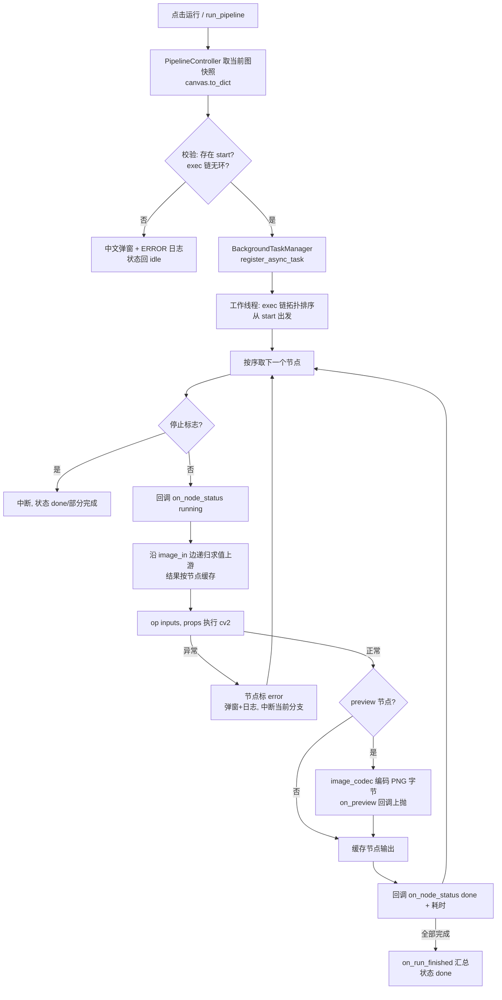
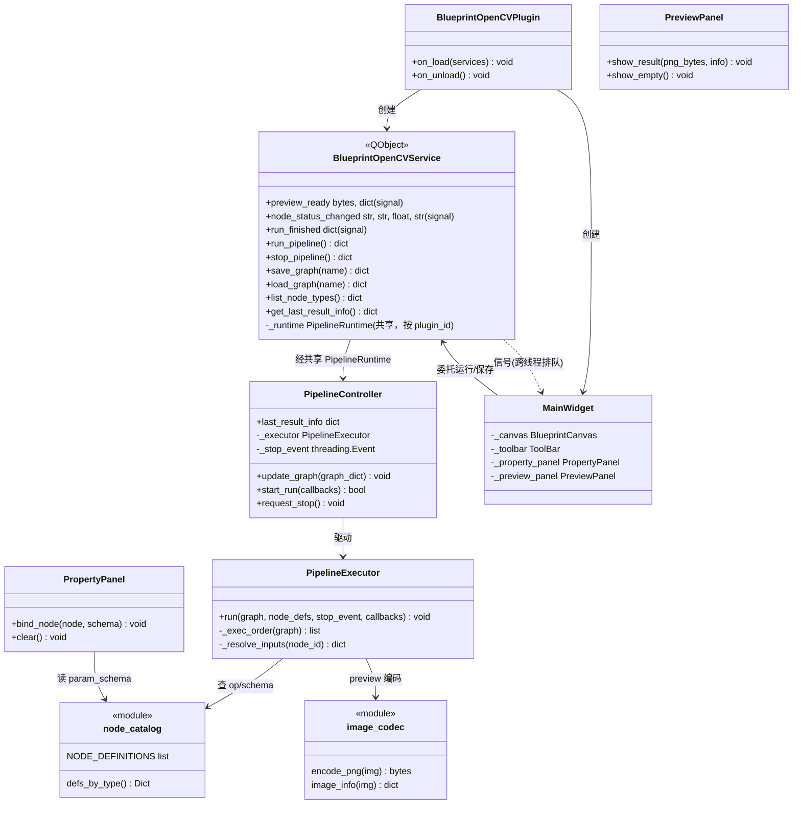
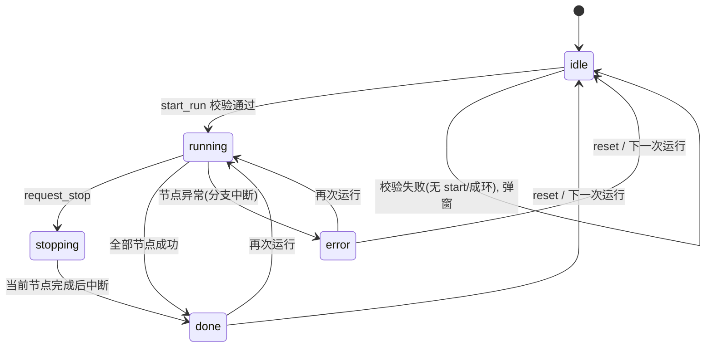
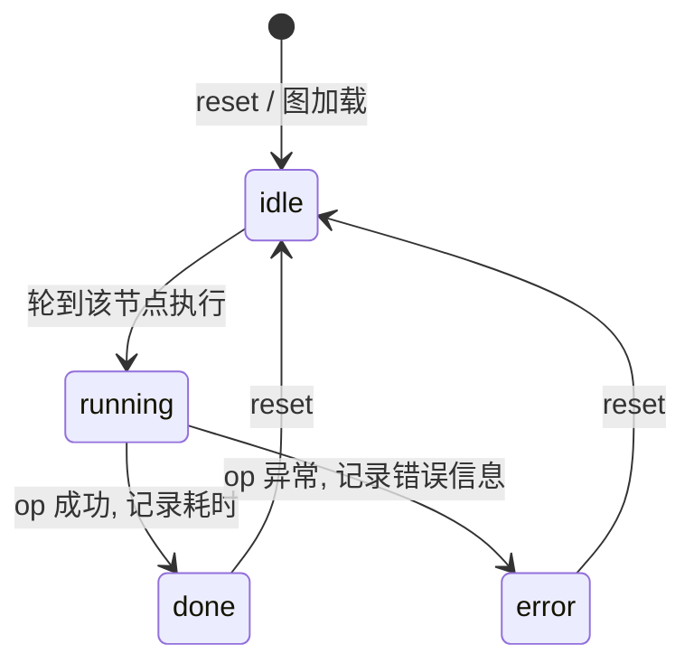

# SPEC — Blueprint OpenCV 插件技术方案

> - 创建日期：2026-07-30
> - 修改日期：2026-08-24
> - 文档状态：草案（待开发者评审）
> - 插件 id：`blueprint-opencv` / 目录：`plugin/blueprint_opencv/`
> - 对应需求文档：`PRD-blueprint-opencv-20260730.md`（同目录）
>
> **修订注记（2026-08-24）**：本文初版中的部分表述已与实现脱节，本次修订
> 就地更正（§1.2 body_builder、§1.3/§4.1 register_async_task、§2 目录结构、
> §3.8/§5 注册载荷与 image_codec、§8 配置表）；当日本批优化的完整决策记录见
> `docs/req/2026-08-24/SPEC-p1p2-optimization-20260824.md`。

---

## 1. 技术方案与关键决策

### 1.1 总体架构

严格四层（entrance 胶水 → service 接口 → function 业务 → ui 视图）：

- `function/`：**纯 Python + numpy + cv2**，禁止 import PySide6 / QWidget。节点目录、op 实现、执行引擎、图像编解码全部在此层，可用脚本独立冒烟。
- `service.py`：`BlueprintOpenCVService` 门面，持有执行引擎与当前图快照，定义 Qt 信号用于工作线程 → UI 线程的结果封送（service 层允许 import QtCore，理由见 §1.4）；service_api 供跨插件/MCP 调用。
- `ui/`：BlueprintCanvas 宿主、工具条、属性面板、预览区；槽函数 ≤ 5 行，委托 service。
- `entrance.py`：组装以上三层，处理加载/卸载。

### 1.2 为什么参数编辑走外部属性面板（而非 body_builder）

Blueprint 的 `register_node_type(..., body_builder=...)` 支持向节点体注入控件，但**画布置节点体为鼠标透明（只展示）**，无法在节点内直接编辑。因此本插件：

- 节点体保持简洁（仅标题 + 引脚 + accent 色条）；`body_builder` 仅用于**只读展示**——含 `file_path` 参数的节点（load_image / save_image）在体区显示当前文件名标签（`ui/node_bootstrap._make_path_body_builder`，标签随 `node.changed` 刷新、随语言切换重取词），不注入任何交互控件；
- 参数编辑统一走**右侧属性面板**：监听 `canvas.selection_changed`，选中单节点时按其参数 schema（见 §3）重建 ParamForm 风格表单，修改即时写回 `node.properties[key] = value` 并 `node.changed.emit()`；
- 节点 `properties` 随 `canvas.to_dict()` 一起序列化，保存/加载无损。

该方案同时是 Blueprint 官方推荐的参数编辑范式，作为样板更具示范价值。

> 修订注记（2026-08-24）：初版表述为「不使用 body_builder」，与实现不符（i18n 批次起 body_builder 已用于体区只读路径标签），就地更正。

### 1.3 为什么执行走工作线程

cv2 处理（滤波、形态学、大图像 imencode）是 CPU 密集操作，在 UI 线程执行会冻结界面。方案：

- 运行触发（UI 按钮或 service_api）→ `BackgroundTaskManager.register_async_task` 把工作提交到框架线程池（`register_sync_task` 是调用方线程内联执行，不满足异步要求）；
- 工作线程内执行管线、产出 **imencode 后的 PNG 字节**（不创建任何 Qt 对象）；
- 结果经 `BlueprintOpenCVService` 的 Qt 信号上抛：信号接收方（UI 控件）在 UI 线程，Qt 自动排队到 UI 线程执行槽函数，槽内创建 QPixmap 并 `ImageView.set_source`；个别非信号路径用 `utils/thread_utils.run_in_ui_thread` 兜底；
- 停止为协作式：执行引擎在每个节点开始前检查停止标志，当前节点执行完后中断。

### 1.4 exec + data 双链语义

图上有两类边，语义严格分离：

- **exec 链**（`exec` data_type，白色引脚）：决定**执行顺序**。从内置 `start` 节点出发沿 `exec_out → exec_in` 边拓扑排序得到执行序列；`exec_in` 单连接。
- **data 链**（`image` data_type）：决定**数据流向**。执行到某节点时，沿其 `image_in` 输入边向上游取数；上游节点若尚未在本轮求值（例如未挂 exec 链的纯数据上游），则按需递归求值；结果按节点缓存，一轮运行内每个节点只求值一次。

不允许 exec 与 image 混连（Blueprint `add_edge` 自带类型校验兜底）；exec 链成环、无 start 节点时拒绝运行并中文提示。

### 1.5 节点类型注册的幂等性与同名冲突纠正

节点注册数据由 `function/node_catalog.py` 的 `NODE_DEFINITIONS` 提供（纯数据，function 层不 import UIKit），注册动作在 `ui/node_bootstrap.py` 的 `ensure_node_types_registered()`（entrance 加载时、`ui/main_widget.py` 模块级及 `MainWidget.showEvent` 各调用一次）。

UIKit `NodeRegistry` 是全局单例，其他插件可能用同名 `type_name` 注册引脚定义不同的 spec（如 ui_demo 蓝图演示页用 in/out/img 引脚注册同名 `load_image` / `gaussian_blur` / `resize`）。因此本插件采用「幂等 + 冲突纠正」语义：既有 spec 与本插件定义（引脚 id / data_type 序列）一致时跳过；同名异定义时重新注册纠正并记 WARNING，保证本插件画布创建的节点引脚 id 与 function 层 op 输出键（`image_out`）一致。热重载（重复 import / 重复调用）不产生重复注册/异常。注册表数据结构本身放在 `NODE_DEFINITIONS`（模块级常量，可安全重复构建）。

### 1.6 序列化与持久化

- 图序列化：`canvas.to_dict()` / `canvas.from_dict(data)`，含节点（含 properties）、边、视图状态。
- 持久化：DataProvider `save_asset`（插件私有命名空间），key 为图名（默认 `default`）；插件启动时有存档则恢复，否则加载 `assets/preset_graph.json` 预置示例图。
- 加载容错：JSON 损坏 / 含未知 type_name 时回退示例图 + 弹窗提示 + ERROR 日志。

---

## 2. 目录结构

```
plugin/blueprint_opencv/
├── IXPlugin.json                 # 描述文件（草案见 PRD §6）
├── README.md                     # 用法 + Blueprint 样板导读
├── __init__.py
├── entrance.py                   # IPlugin 入口（胶水层）
├── information.py                # IPluginInfo：version/service_api 声明
├── service.py                    # BlueprintOpenCVService（QObject 门面 + service_api）
├── config/
│   └── default.json              # 默认配置（见 §8）
├── assets/
│   ├── sample.png                # 预置示例输入图片
│   └── preset_graph.json         # 预置示例图（canvas.to_dict 格式）
├── function/                     # 纯 Python 业务层（禁 PySide6）
│   ├── __init__.py
│   ├── constants.py              # 命名常量：引脚 id、分类 accent、状态枚举值、默认尺寸等
│   ├── node_catalog.py           # NODE_DEFINITIONS 注册表 + defs_by_type()（纯数据，注册动作在 ui/node_bootstrap）
│   ├── param_schema.py           # 参数 schema 类型定义与校验（供属性面板/引擎共用）
│   ├── image_codec.py            # numpy → PNG 字节编码（imencode）与图像元信息
│   ├── executor.py               # PipelineExecutor：exec 拓扑排序（三色标记判环）+ 数据流求值 + 状态回调
│   ├── pipeline_controller.py    # PipelineController：运行会话管理（停止标志、图快照、最近结果、节点数上限）
│   ├── runtime_registry.py       # 共享运行实例注册表（PipelineRuntime，按 plugin_id 进程内唯一）
│   └── ops/                      # 节点 op 实现（op(inputs, props) -> outputs）
│       ├── __init__.py           # 汇总导出
│       ├── input_ops.py          # load_image / generate_noise / solid_color
│       ├── basic_ops.py          # grayscale / invert / resize / flip / rotate
│       ├── filter_ops.py         # gaussian_blur / median_blur / bilateral
│       ├── threshold_ops.py      # threshold / adaptive_threshold / canny
│       ├── morphology_ops.py     # morphology
│       ├── adjust_ops.py         # brightness_contrast / sharpen / hsv_convert
│       └── output_ops.py         # preview（透传捕获）/ save_image
├── ui/
│   ├── __init__.py
│   ├── main_widget.py            # 主界面组装：工具条 + 左侧面板 + 画布 + 右侧面板
│   ├── toolbar.py                # 工具条（运行/停止/保存/另存为/适应视图/状态标签，显式运行态字段）
│   ├── node_bootstrap.py         # 节点类型注册引导（幂等 + 同名异定义纠正）与 param_schema 查询
│   ├── node_list_panel.py        # 节点列表面板（全量节点清单 + 定位/重命名/删除）
│   ├── graph_list_panel.py       # 蓝图存档列表面板（另存为/加载/重命名/删除）
│   ├── property_panel.py         # 参数面板：按 schema 重建表单，写回 node.properties
│   ├── preview_panel.py          # 预览区：ImageView + 结果信息（尺寸/通道/耗时）
│   ├── plugin_config.py          # config/default.json 读取与缺省回退（ui 层唯一入口）
│   └── dialogs.py                # 模态对话框统一封装（UIKit Dialog 替代原生弹窗）
└── docs/
    └── req/2026-07-30/           # PRD 与本 SPEC
```

模块职责边界：

- `node_catalog.py` 只做"定义与注册"，不写 cv2 逻辑；op 函数引用自 `ops/`。
- `executor.py` 不知道 Qt、不知道 DataProvider；输入是图 dict + 停止标志 + 回调集合，输出经回调上报。
- `pipeline_controller.py` 是 function 层的会话状态持有者（当前图快照、运行状态、最近结果信息），service 与 ui 都通过它交互，避免 service/ui 直接操作 executor 细节。
- ui 层不出现 cv2 / numpy。

---

## 3. 节点定义表（开发契约）

> 本节是后续并行开发的**唯一契约**。字段含义：
>
> - **引脚**：`输入 → 输出`，`exec`/`image` 为 Blueprint 内置 data_type。除注明外，所有节点均有 `exec_in`（exec，输入）与 `exec_out`（exec，输出）。
> - **参数**：即 `node.properties` 的 schema，格式为 `{key, label, type, default, min?, max?, options?}`；type ∈ `int / float / str / choice / file_path / color`。`int(odd)` 表示取奇数（偶数输入自动 +1）。
> - **op 语义**：`op(inputs: Dict[str, np.ndarray], props: Dict[str, Any]) -> Dict[str, np.ndarray]`；`inputs` 以输入引脚 id 为键，返回值以图像输出引脚 id 为键。

### 3.0 通用约定

| 约定 | 值 |
|------|----|
| exec 引脚 id | 输入 `exec_in`，输出 `exec_out` |
| 图像引脚 id | 输入 `image_in`，输出 `image_out`（输入类节点只有 `image_out`；save_image 只有 `image_in`） |
| 图像数据格式 | `np.ndarray`，uint8；彩色为 BGR 三通道，灰度为单通道 |
| 灰度自动适配 | 标注"需单通道"的节点，收到三通道输入时先 `cv2.cvtColor(BGR2GRAY)` 再处理（防御性，不报错） |
| 分类 accent（constants.py 命名常量） | 输入 `#4CAF50`、基础 `#2196F3`、滤波 `#9C27B0`、阈值与边缘 `#FF9800`、形态学 `#795548`、调整 `#00BCD4`、输出 `#F44336` |
| 内置节点 | Blueprint 自带 `start`（流程分类，exec 输出），作为 exec 链唯一起点 |

### 3.1 输入（分类：输入）

| type_name | 标题 | 引脚（入→出） | 参数 schema | op 语义 |
|-----------|------|---------------|-------------|---------|
| `load_image` | 加载图片 | `exec_in` → `exec_out`, `image_out` | `file_path: file_path`（默认 `""`，指向插件资产示例图） | `cv2.imread(file_path)` 读为 BGR；路径为空/文件不存在/解码失败抛 `NodeExecutionError` |
| `generate_noise` | 生成噪声 | `exec_in` → `exec_out`, `image_out` | `width: int`（默认 640，1–4096）；`height: int`（默认 480，1–4096）；`noise_type: choice`（`gaussian`/`uniform`/`salt_pepper`，默认 `gaussian`） | 按类型生成 H×W×3 uint8 噪声图（高斯：均值 128 σ=32 截断；均匀：0–255；椒盐：5% 黑白点） |
| `solid_color` | 纯色图像 | `exec_in` → `exec_out`, `image_out` | `width: int`（默认 640，1–4096）；`height: int`（默认 480，1–4096）；`color: color`（默认 `#3B82F6`，hex 字符串） | hex → BGR，生成 H×W×3 纯色图；非法 hex 抛 `NodeExecutionError` |

### 3.2 基础（分类：基础）

| type_name | 标题 | 引脚（入→出） | 参数 schema | op 语义 |
|-----------|------|---------------|-------------|---------|
| `grayscale` | 灰度化 | `exec_in`, `image_in` → `exec_out`, `image_out` | 无 | 三通道 → `cv2.cvtColor(BGR2GRAY)`；已是单通道则透传 |
| `invert` | 反色 | 同上 | 无 | `cv2.bitwise_not` |
| `resize` | 缩放 | 同上 | `scale_mode: choice`（`fixed`/`scale`，默认 `scale`）；`width: int`（默认 640，1–4096）；`height: int`（默认 480，1–4096）；`scale: float`（默认 1.0，0.01–10.0）；`interpolation: choice`（`nearest`/`linear`/`cubic`/`area`，默认 `linear`） | `scale` 模式按倍率、`fixed` 模式按目标宽高 `cv2.resize`；插值映射 `INTER_NEAREST/LINEAR/CUBIC/AREA` |
| `flip` | 翻转 | 同上 | `direction: choice`（`horizontal`/`vertical`/`both`，默认 `horizontal`） | `cv2.flip`，映射 flipCode 1 / 0 / -1 |
| `rotate` | 旋转 | 同上 | `angle: choice`（`90_cw`/`180`/`90_ccw`，默认 `90_cw`） | `cv2.rotate`，映射 `ROTATE_90_CLOCKWISE / ROTATE_180 / ROTATE_90_COUNTERCLOCKWISE` |

### 3.3 滤波（分类：滤波）

| type_name | 标题 | 引脚（入→出） | 参数 schema | op 语义 |
|-----------|------|---------------|-------------|---------|
| `gaussian_blur` | 高斯模糊 | `exec_in`, `image_in` → `exec_out`, `image_out` | `ksize: int(odd)`（默认 5，1–99）；`sigma_x: float`（默认 0，0–50；0 表示由 ksize 自动推导） | `cv2.GaussianBlur(img, (k,k), sigmaX=sigma_x)` |
| `median_blur` | 中值模糊 | 同上 | `ksize: int(odd)`（默认 5，3–99，≥3） | `cv2.medianBlur` |
| `bilateral` | 双边滤波 | 同上 | `d: int`（默认 9，1–50）；`sigma_color: float`（默认 75，1–300）；`sigma_space: float`（默认 75，1–300） | `cv2.bilateralFilter` |

### 3.4 阈值与边缘（分类：阈值与边缘）

| type_name | 标题 | 引脚（入→出） | 参数 schema | op 语义 |
|-----------|------|---------------|-------------|---------|
| `threshold` | 固定阈值 | `exec_in`, `image_in` → `exec_out`, `image_out` | `thresh: int`（默认 127，0–255）；`max_value: int`（默认 255，1–255）；`thresh_type: choice`（`binary`/`binary_inv`/`trunc`/`tozero`/`tozero_inv`，默认 `binary`） | 需单通道（自动适配，见 §3.0）；`cv2.threshold`，类型映射 `THRESH_BINARY` 等五个常量 |
| `adaptive_threshold` | 自适应阈值 | 同上 | `max_value: int`（默认 255，1–255）；`method: choice`（`mean`/`gaussian`，默认 `gaussian`）；`thresh_type: choice`（`binary`/`binary_inv`，默认 `binary`）；`block_size: int(odd)`（默认 11，3–99）；`c: int`（默认 5，-50–50） | 需单通道；`cv2.adaptiveThreshold`，方法映射 `ADAPTIVE_THRESH_MEAN_C / GAUSSIAN_C` |
| `canny` | Canny 边缘 | 同上 | `low: int`（默认 50，0–255）；`high: int`（默认 150，0–255） | `cv2.Canny(img, low, high)`；low > high 时抛 `NodeExecutionError`（参数非法） |

### 3.5 形态学（分类：形态学）

| type_name | 标题 | 引脚（入→出） | 参数 schema | op 语义 |
|-----------|------|---------------|-------------|---------|
| `morphology` | 形态学操作 | `exec_in`, `image_in` → `exec_out`, `image_out` | `op: choice`（`erode`/`dilate`/`open`/`close`/`gradient`/`tophat`/`blackhat`，默认 `open`）；`ksize: int`（默认 3，1–31）；`iterations: int`（默认 1，1–10）；`shape: choice`（`rect`/`ellipse`/`cross`，默认 `rect`） | 结构元 `cv2.getStructuringElement(shape, (k,k))`；erode/dilate 用对应 API，其余用 `cv2.morphologyEx`（`MORPH_OPEN/CLOSE/GRADIENT/TOPHAT/BLACKHAT`） |

### 3.6 调整（分类：调整）

| type_name | 标题 | 引脚（入→出） | 参数 schema | op 语义 |
|-----------|------|---------------|-------------|---------|
| `brightness_contrast` | 亮度对比度 | `exec_in`, `image_in` → `exec_out`, `image_out` | `alpha: float`（默认 1.0，0.1–3.0，对比度）；`beta: int`（默认 0，-255–255，亮度） | `cv2.convertScaleAbs(img, alpha, beta)` |
| `sharpen` | 锐化 | 同上 | `strength: float`（默认 1.0，0–3.0） | 反锐化掩模：`blur = GaussianBlur(img,(0,0),3)`；`cv2.addWeighted(img, 1+s, blur, -s, 0)` |
| `hsv_convert` | HSV 转换 | 同上 | `direction: choice`（`to_hsv`/`from_hsv`，默认 `to_hsv`） | 需三通道（单通道先转 BGR）；`cv2.cvtColor` `BGR2HSV / HSV2BGR` |

### 3.7 输出（分类：输出）

| type_name | 标题 | 引脚（入→出） | 参数 schema | op 语义 |
|-----------|------|---------------|-------------|---------|
| `preview` | 预览 | `exec_in`, `image_in` → `exec_out`, `image_out` | 无 | 透传：`image_out = image_in`；**引擎在求值完成后触发 `on_preview` 回调**（见 §4），由 image_codec 编码为 PNG 字节上抛 UI。多个 preview 节点时 UI 显示最后执行者 |
| `save_image` | 保存图片 | `exec_in`, `image_in` → `exec_out`（无图像输出） | `file_path: file_path`（默认 `""`，保存对话框） | `cv2.imwrite(file_path, img)`；路径为空/写入失败抛 `NodeExecutionError`；返回 `{}` |

### 3.8 注册信息组装

`NODE_DEFINITIONS: List[NodeDefinition]`，`NodeDefinition` 为 dataclass：

```python
@dataclass(frozen=True)
class NodeDefinition:
    type_name: str            # 唯一类型名（上表 type_name）
    title: str                # 显示标题
    category: str             # 分类（决定右键菜单分组与 accent）
    inputs: list[dict]        # Blueprint 引脚定义 {"id","name","data_type","multi"?}
    outputs: list[dict]
    param_schema: list[dict]  # §3 参数列（供属性面板）
    op: Callable              # ops/ 中的函数引用
    description: str          # 节点一句话说明（菜单提示）
```

注册载荷由 `ui/node_bootstrap.ensure_node_types_registered()` 直接按 `NODE_DEFINITIONS` 组装 `register_node_type(...)` 参数（标题/分类/描述按当前语言取词，accent 按分类常量取色，含 `file_path` 参数的节点附加只读体区标签 body_builder），幂等 + 同名冲突纠正见 §1.5。

> 修订注记（2026-08-24）：初版由 node_catalog 提供 `registration_payloads()` 载荷函数；注册动作上移到 ui 层后该函数无调用方，已随 2026-08-24 批次移除。

---

## 4. 执行引擎数据流

### 4.1 运行流程



### 4.2 数据求值规则（契约）

1. **执行序列**：从 start 沿 `exec_out` 边 DFS/BFS 拓扑排序；不在 exec 链上的节点不会作为"执行步骤"出现，但可作为数据上游被**按需求值**。
2. **取数**：执行节点 N 时，对 N 的每个 `image_in` 引脚找到唯一入边（单连接语义），取上游节点对应输出引脚的值；上游未求值则递归求值（同一轮运行内 `Dict[node_id, Dict[pin_id, np.ndarray]]` 缓存）。
3. **输入缺失**：节点 `image_in` 未连线且该引脚为必需时，抛 `NodeExecutionError`（"输入未连接"）。
4. **preview 上抛**：引擎检测求值完成的节点 type_name == `preview`，调用 `image_codec.encode_png(img)` 并触发 `on_preview(node_id, png_bytes, info)`；info 含 `{"width","height","channels","elapsed_ms"}`。
5. **错误隔离**：节点异常 → 该节点 error、其 exec 后继不再执行；无 exec 依赖关系的其他分支不受影响（本版 exec 链为单链时即整体中断，语义等同）。

### 4.3 回调接口（function 层，无 Qt）

```python
@dataclass
class ExecutorCallbacks:
    on_node_status: Callable[[str, str, float, str], None]  # node_id, status, elapsed_ms, message
    on_preview: Callable[[str, bytes, dict], None]          # node_id, png_bytes, info
    on_run_finished: Callable[[dict], None]                 # summary: {"status","total_ms","node_count","errors":[...]}
```

status 取值（constants.py 常量）：`"running"` / `"done"` / `"error"`。

---

## 5. 类关系



线程边界：`PipelineExecutor` / `image_codec` 仅在工作线程活动；`MainWidget` 及其子面板仅在 UI 线程；两者之间只传**不可变数据**（图 dict、PNG 字节、info dict），经 service 的 Qt 信号自动排队封送。

---

## 6. 执行状态机

### 6.1 运行级状态机



### 6.2 节点级状态机（ExecutionController 指示）



UI 映射：`ExecutionController.start/finish/fail/reset` 与 `set_path` 用于画布上的节点高亮与连线动效；工具条状态标签显示运行级状态与总耗时。

---

## 7. service_api 方法签名

`information.py` 中 `service_api` 声明以下方法（框架自动注册跨插件 API + 同步 MCP 工具）。全部返回 `{"success": bool, ...}`；失败时含 `"error": str`（中文原因）。

```python
class BlueprintOpenCVService(QObject):

    # ---- 信号（非 service_api，供 UI/内部订阅，跨线程自动排队）----
    # preview_ready(bytes, dict)         — preview 节点结果 PNG 字节 + info
    # node_status_changed(str, str, float, str) — node_id, status, elapsed_ms, message
    # run_finished(dict)                 — 运行汇总 summary

    def run_pipeline(self) -> dict:
        """运行当前图管线（异步，工作线程执行）。
        返回: {"success": True, "data": {"started": True}}
              {"success": False, "error": "无 start 节点，无法运行"}"""

    def stop_pipeline(self) -> dict:
        """请求停止当前运行（协作式，当前节点完成后中断）。
        返回: {"success": True, "data": {"stopping": True}}"""

    def save_graph(self, name: str = "default") -> dict:
        """将当前图序列化并经 DataProvider 持久化。
        返回: {"success": True, "data": {"name": name, "node_count": int}}"""

    def load_graph(self, name: str = "default") -> dict:
        """从 DataProvider 恢复指定图到画布；不存在/损坏时回退示例图。
        返回: {"success": True, "data": {"name": name, "fallback": bool}}"""

    def list_node_types(self) -> dict:
        """列出全部已注册节点类型（Blueprint 样板/动态表单场景使用）。
        返回: {"success": True, "data": {"nodes": [
                  {"type_name", "title", "category", "inputs", "outputs",
                   "param_schema", "description"}, ...]}}"""

    def get_last_result_info(self) -> dict:
        """最近一次运行的汇总信息与 preview 结果元数据（不含图像本体）。
        返回: {"success": True, "data": {
                  "status": "done|error|idle", "total_ms": float,
                  "node_count": int, "errors": list,
                  "preview": {"width","height","channels","elapsed_ms"} | None}}"""
```

跨线程说明：`run_pipeline` / `stop_pipeline` 可被 MCP 线程调用，内部经 `threading.Event` 与 BackgroundTaskManager 提交，不直接触碰 UI 控件；UI 更新只发生在 UI 线程的信号槽中。

---

## 8. 配置项（`config/default.json`）

```json
{
  "graph": {
    "default_name": "default",
    "storage_namespace": "graphs",
    "max_nodes": 256
  },
  "preview": {
    "max_width": 960,
    "max_height": 720
  },
  "panel": {
    "right_panel_width": 320,
    "min_canvas_width": 480
  },
  "assets": {
    "sample_image": "assets/sample.png"
  }
}
```

| 键 | 用途 | 消费方 |
|----|------|--------|
| `graph.default_name` / `storage_namespace` | DataProvider 存图的默认 key 与命名空间 | service.py 同名常量（跨插件路径不读配置，配置值应与常量保持一致） |
| `graph.max_nodes` | 防御性上限，超过拒绝运行（防失控大图） | ui 层读取后经 `service.set_max_nodes` 透传到 PipelineController；缺省为 `function/constants.py` 的 `DEFAULT_MAX_NODES` |
| `preview.max_width/max_height` | 预览显示前的等比缩放上限（缩放仅影响显示，不影响数据） | `ui/preview_panel.py`（经 `ui/plugin_config.py`） |
| `panel.right_panel_width` / `min_canvas_width` | 右侧固定面板宽、画布最小宽 | `ui/main_widget.py`（经 `ui/plugin_config.py`） |
| `assets.sample_image` | 预置示例输入图相对路径（相对插件目录） | `ui/main_widget.build_preset_graph()`（经 `ui/plugin_config.py`） |

配置读取统一收口在 `ui/plugin_config.py`（缺失/损坏记 WARNING 并回退上表缺省值）；service / function 层不读配置。预置示例图路径不进配置：`assets/preset_graph.json` 的唯一来源是 service.py 的 `PRESET_GRAPH_RELATIVE_PATH` 常量（跨插件 / MCP 路径不依赖配置文件）。

> 修订注记（2026-08-24）：初版 `assets` 段含 `preset_graph` 键，因无 ui 层消费方且 service 层以常量为单一来源，本次从配置中删除；`preview.*` / `panel.min_canvas_width` / `graph.max_nodes` 由「声明未接线」补齐为实际消费。

节点参数默认值不进配置文件，统一由 §3 的 param_schema `default` 字段承载（单一来源）。

---

## 9. 分批实施计划与 Commit 建议

> 仓库：`plugin/` 仓库 `dev` 分支；按功能颗粒度提交，单功能验证通过即提交。Commit 信息格式 `feat(blueprint-opencv): 中文描述`；**是否加自定义前缀（如 Framework_Fix:）提交前须询问开发者确认**。

| 批次 | 内容 | 验证方式 | 建议 Commit |
|------|------|----------|-------------|
| B1 | 目录骨架、`IXPlugin.json`、`entrance/information/service` 空壳、`config/default.json`、README 雏形 | 应用启动，插件出现在面板并可打开空界面 | `feat(blueprint-opencv): 新增插件骨架与描述文件` |
| B2 | `constants.py`、`param_schema.py`、`ops/` 七个 op 模块、`node_catalog.py` | 临时脚本（仓库 `temp/`）：构造 numpy 输入逐节点断言输出 shape/dtype；注册幂等性（连续两次 register 不炸） | `feat(blueprint-opencv): 实现 20 个 OpenCV 节点定义与 op 函数` |
| B3 | `image_codec.py`、`executor.py`、`pipeline_controller.py` | 临时脚本：内存构图 dict 跑通 start→generate_noise→gaussian_blur→preview，断言回调序列与 PNG 字节；异常分支标 error | `feat(blueprint-opencv): 实现管线执行引擎与图像编解码` |
| B4 | `ui/` 四个模块：画布宿主、工具条、属性面板、预览面板 | 运行应用：右键建节点、拖线、选节点改参数、运行看状态与预览；长时间处理期间 UI 不卡 | `feat(blueprint-opencv): 实现主界面（画布/工具条/属性面板/预览）` |
| B5 | service_api 六方法、DataProvider 图保存/加载、启动恢复 | 运行应用：改图→保存→重启→恢复；冒烟脚本调 list_node_types/run_pipeline 断言返回结构 | `feat(blueprint-opencv): 实现 service_api 与图持久化` |
| B6 | `assets/sample.png`、`assets/preset_graph.json` 预置示例图、停止/重置/清空交互收尾 | 全新环境（删 DataProvider 存档）启动即见示例图并一键跑通 | `feat(blueprint-opencv): 增加预置示例图与示例资产` |
| B7 | 同步 `plugin/IXRepo.json` 条目、README 与 docs 收尾、交叉验证 | 对照代码核对文档；IXRepo.json 结构校验 | `feat(blueprint-opencv): 同步 IXRepo.json 并完善文档` |

### 验收检查单（DoD）

- [ ] 20 个节点全部可创建、可连线、参数可编辑、语义与 §3 一致
- [ ] 示例图一键运行成功，节点状态与耗时正确显示
- [ ] cv2 处理期间 UI 可正常交互（拖动节点、滚动面板无卡顿）
- [ ] 图保存/重启恢复/损坏回退三条路径均验证
- [ ] `list_node_types` / `run_pipeline` 经跨插件调用验证返回结构
- [ ] 热重载插件不报错、节点菜单无重复项
- [ ] `function/` 全文无 PySide6 import（grep 验证）；ui 槽函数 ≤ 5 行；无魔法数
- [ ] 错误路径（无 start、成环、文件不存在、low>high）均有中文弹窗 + ERROR 日志
