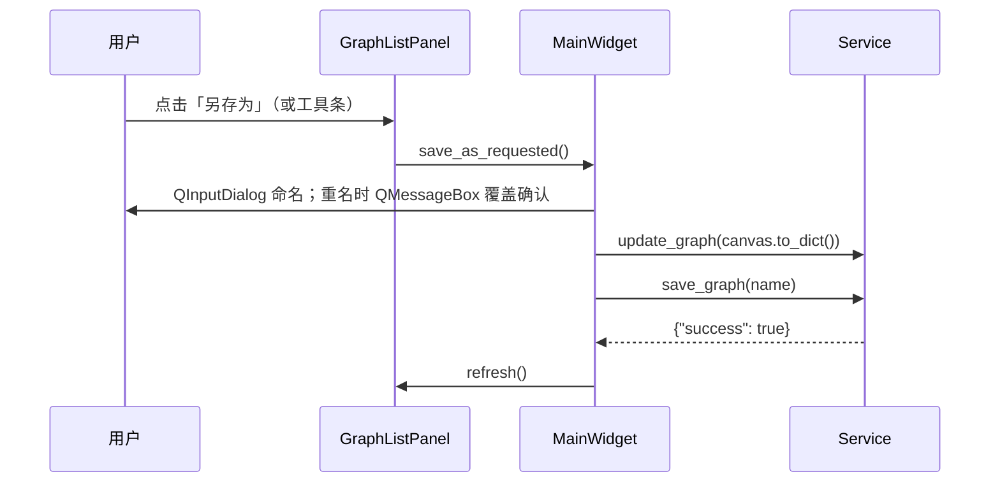
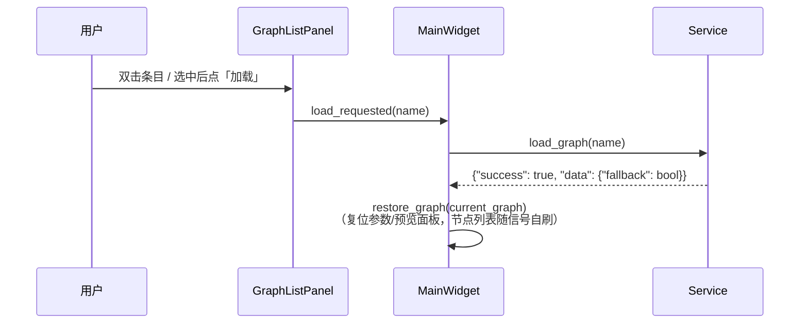

# SPEC — Blueprint OpenCV 已保存蓝图列表技术方案

> - 创建日期：2026-07-30
> - 修改日期：2026-07-30
> - 文档状态：草案（待开发者评审）
> - 插件 id：`blueprint-opencv` / 目录：`plugin/blueprint_opencv/`
> - 对应需求文档：`PRD-graph-list-20260730.md`（同目录）

---

## 1. 技术方案与关键决策

### 1.1 总体方案

- **service 层**：`BlueprintOpenCVService` 新增 `list_graphs()` / `delete_graph(name)` / `rename_graph(old_name, new_name)` 三个公开方法，存档文件操作全部落在既有 DataProvider 资产目录（`assets_dir/<plugin_id>/graphs/`，与 `_ensure_storage_dir` 同一路径模式）；抽出 `_storage_dir()` 私有方法供四处复用。
- **UI 层**：新增 `ui/graph_list_panel.py`（`GraphListPanel`），左栏改为上「蓝图」区 + 下「节点」区；「另存为 / 加载」需画布配合，经 Qt 信号转发 `MainWidget`；「重命名 / 删除」面板内闭环（service 调用 + 弹窗 + 日志 + 刷新）。
- **工具条**：「保存图」改文案「另存为」（语义同步改为命名对话框保存），移除「加载图」按钮与 `load_requested` 信号。

### 1.2 为什么「另存为 / 加载」走信号转发而「重命名 / 删除」面板闭环

另存为需要先 `update_graph(canvas.to_dict())` 推快照、保存后刷新列表与状态标签；加载需要 `canvas.from_dict` 恢复画布并复位参数 / 预览面板——两者都依赖 `MainWidget` 持有的画布与兄弟面板，故面板只发信号（`save_as_requested()` / `load_requested(str)`），由 `MainWidget` 槽（≤5 行委托）编排。重命名 / 删除是纯存档文件操作，面板直接调 service 并自刷，符合 SRP。

### 1.3 存档元信息

`list_graphs()` 逐项返回：

| 字段 | 类型 | 说明 |
|------|------|------|
| `name` | str | 存档名（文件名去 `.json`） |
| `node_count` | int \| None | 节点数（读取存档 JSON 统计；损坏为 None，不拖垮枚举） |
| `size_bytes` | int | 文件大小 |
| `modified_at` | str | 修改时间（本地时间 ISO，`YYYY-MM-DD HH:MM:SS`，MCP 友好可直接展示） |

### 1.4 图名校验

`_validate_graph_name(name)`：空 / 纯空白 → 「图名不能为空」；含 `<>:"/\|?*`（命名常量 `INVALID_NAME_CHARS`，Windows 文件名禁用字符）→ 中文报错。`rename_graph` 对旧 / 新名均校验；`delete_graph` 校验名；`save_graph` 的非法名由文件系统 OSError 兜底（既有错误路径）。

### 1.5 启动加载

`MainWidget.__init__` 末尾由「空图则构建预置图」改为 `_load_initial_graph()`：`service.load_graph()`（缺省 `default`）成功且非回退 → `restore_graph(current_graph)`；否则维持既有 `build_preset_graph()` 回退。无存档 / 存档损坏时行为与现状完全一致。

---

## 2. 布局与操作时序

### 2.1 左栏布局

拉伸比：蓝图区 2 : 节点区 3。

### 2.2 另存为时序

### 2.3 加载时序

---

## 3. 类设计

### 3.1 `BlueprintOpenCVService` 新增方法（service.py）

| 方法 | 说明 |
|------|------|
| `list_graphs() -> dict` | 枚举 `graphs/` 下 `*.json`，返回 §1.3 元信息列表；目录不存在返回空列表；OSError 记 ERROR 并返回失败 |
| `delete_graph(name) -> dict` | 校验名 → `unlink`；不存在返回「存档不存在」；OSError 记 ERROR |
| `rename_graph(old_name, new_name) -> dict` | 双名校验 → 旧档不存在 / 新名冲突中文报错 → `Path.rename` |
| `_storage_dir() -> Path` | 存档目录路径（`_ensure_storage_dir` 改为复用它） |
| `_graph_file_meta(path) -> dict` | 单文件元信息组装（`_read_graph_node_count` 读取节点数，失败 None） |
| `_validate_graph_name(name) -> Optional[str]` | 静态校验，合法返回 None，否则中文原因 |

### 3.2 `GraphListPanel(QWidget)`（ui/graph_list_panel.py）

信号：`load_requested(str)`、`save_as_requested()`。

| 成员 | 说明 |
|------|------|
| `refresh()` | 重新枚举存档重建列表（保留同名选中态），同步空态与按钮态 |
| `current_graph_name() -> Optional[str]` | 选中行存档名（item `UserRole`） |
| `_add_row(meta)` | 建行：`_GraphRow` 两行（名称 + `N 个节点 · 保存时间`，时间以 `%m-%d %H:%M` 短格式显示防 200px 栏裁断，完整时间入 tooltip），item widget 鼠标透明（同 NodeListPanel 变通） |
| `_rename_current()` | 槽（≤5 行）：委托 `_prompt_rename(name)` |
| `_delete_current()` | 槽（≤5 行）：委托 `_confirm_delete(name)` |
| `_load_current()` / `_on_double_click(item)` | 发 `load_requested` |
| `_report_error(title, message)` | 中文弹窗 + ERROR 日志（面向用户的错误两者都要） |

### 3.3 `MainWidget` 改动

| 成员 | 说明 |
|------|------|
| `_save_graph_as()` | 替代原 `_save_graph`：命名对话框 → 覆盖确认 → 推快照 → `save_graph(name)` → 列表刷新 + 状态标签 |
| `_load_graph_by_name(name)` | 替代原 `_load_graph`：`load_graph(name)` → `restore_graph`，回退时状态标签说明 |
| `_load_initial_graph()` | 启动加载（§1.5） |
| `_build_left_panel()` | 上「蓝图」`graph_list_panel`(2) + 下「节点」`node_list_panel`(3) |

### 3.4 `ToolBar` 改动

「保存图」→「另存为」（`save_requested` 信号保留）；移除「加载图」按钮与 `load_requested` 信号（加载由列表承担，PRD FR-8）。

### 3.5 service_api 声明同步（information.py）

`_api_graph_methods` 扩展为五方法（save/load + list/delete/rename），模块与类 docstring「六个方法」改「九个方法」。参数声明与实现签名逐一一致：

- `list_graphs`：无参数；
- `delete_graph`：`name`（str，必填）；
- `rename_graph`：`old_name` / `new_name`（str，均必填）。

### 3.6 验证方案

1. `python -m compileall plugin/blueprint_opencv -q`；
2. offscreen 断言脚本（`temp/`，不提交）：另存为两个命名存档 → 列表 2 项含元信息 → 加载切换画布内容正确 → 重命名生效且冲突报错 → 删除后列表减少 → default 存档存在时新建 MainWidget 自动加载、无 default 时预置图；附 service_api 声明与实现签名比对；
3. 截图 `temp/screenshots/blueprint_opencv/06_graph_list.png`（≥2 个存档），人工目检；
4. 回归 `temp/bp_opencv_e2e.py` 全过。
