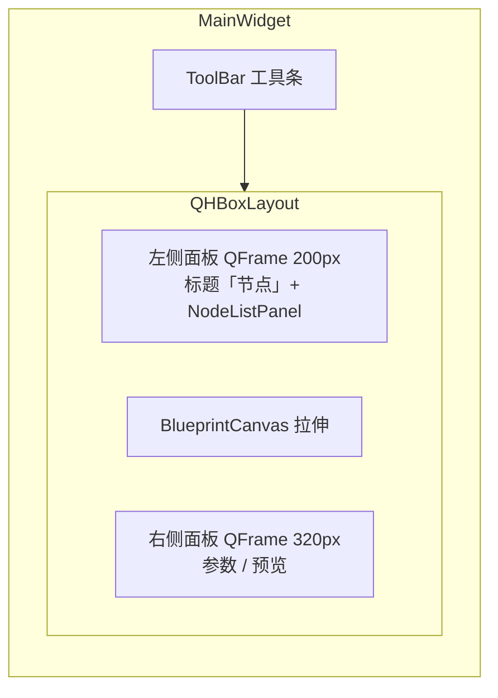
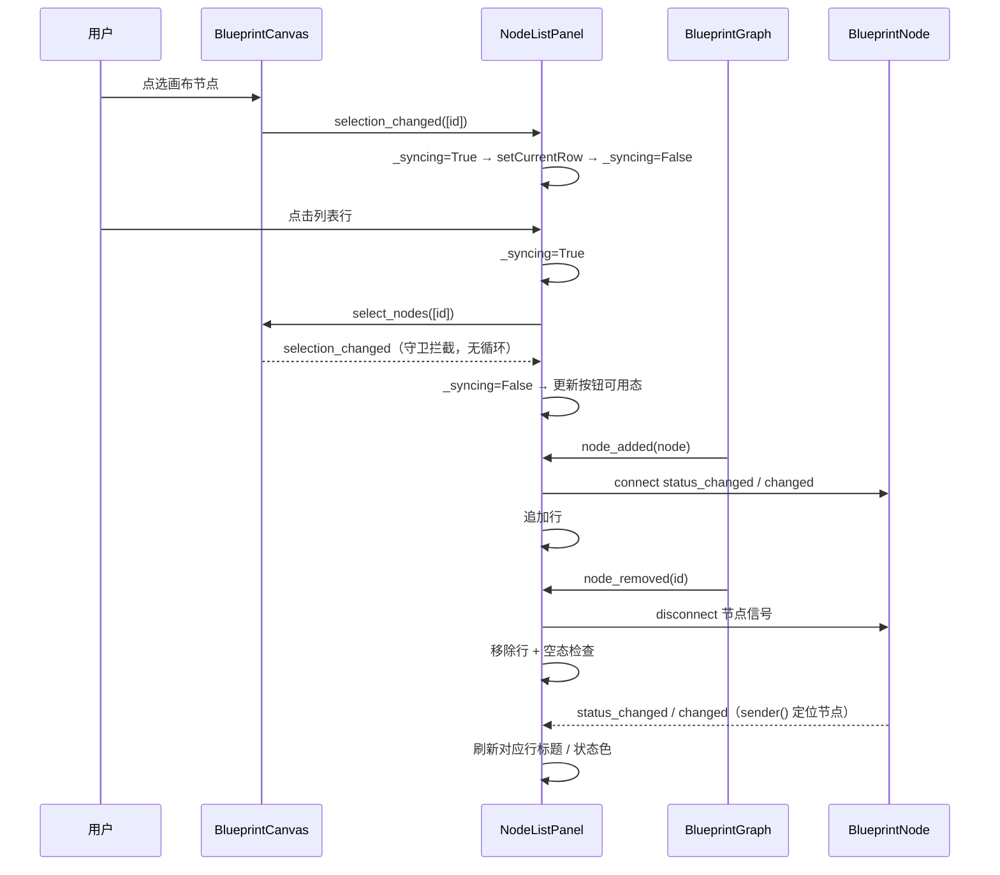

# SPEC — Blueprint OpenCV 蓝图节点列表面板技术方案

> - 创建日期：2026-07-30
> - 修改日期：2026-07-30
> - 文档状态：草案（待开发者评审）
> - 插件 id：`blueprint-opencv` / 目录：`plugin/blueprint_opencv/`
> - 对应需求文档：`PRD-node-list-panel-20260730.md`（同目录）

---

## 1. 技术方案与关键决策

### 1.1 总体方案

新增 `ui/node_list_panel.py`，定义 `NodeListPanel(QWidget)`：内部为 UIKit `ListWidget`（行高 48，自定义行控件两行布局）+ 「定位 / 重命名 / 删除」按钮行 + 空态占位标签。`MainWidget` 在画布左侧以固定宽 200px 的 `QFrame` 挂载（命名常量 `_LEFT_PANEL_WIDTH`），与右侧 320px 参数 / 预览面板对称。

面板构造时接收 `graph` / `canvas` 引用并自行完成全部信号接线，`MainWidget` 只做布局组装（符合「UI 层不写业务逻辑」，列表对 graph / canvas 的操作与画布自身的编辑操作同属视图层语义）。

### 1.2 行渲染：自定义行控件 + 鼠标透明

列表每行展示两个信息层次（第一行：状态色点 + 标题；第二行：`类型名 · 状态`，done 时追加耗时）。`QListWidgetItem` 纯文本无法双色分行，故用私有 `_NodeRow(QWidget)` 经 `setItemWidget` 挂载。

关键变通：item widget 会截获鼠标事件导致点击行不触发列表选中，因此对 `_NodeRow` 及其全部子 `QLabel` 设置 `Qt.WA_TransparentForMouseEvents`，让点击穿透到列表视口，选中行为与原生列表一致。

### 1.3 状态色：主题令牌映射

| 状态 | 令牌键 |
|------|--------|
| idle | `color.text.tertiary` |
| running | `color.primary` |
| done | `color.success` |
| error | `color.danger` |

查表（`_STATUS_COLOR_KEYS`）替代 if-elif 链；色值经 `T()` 实时取自令牌，light / dark 主题均正确。

### 1.4 双向同步与防信号循环

- `canvas.selection_changed` → 列表 `setCurrentRow`（单选时；多选 / 空选时清列表选中）；
- 列表 `currentRowChanged` → `canvas.select_nodes([id])`；
- 两个方向都用 `_syncing` 标志位守卫：进入处理器时置位，回写对端后复位；对端被 programmatic 触发回调的回传信号在守卫下直接返回，杜绝 A→B→A 循环。

### 1.5 节点级信号的生命周期

新节点加入（`graph.node_added` 或构造期存量节点）时挂接 `node.status_changed` 与 `node.changed` 到同一槽（槽内用 `sender()` 取节点，避免 lambda 闭包持有引用）；节点删除（`graph.node_removed`）时显式 `disconnect` 后移除行。`node.changed` 覆盖标题修改（本面板重命名即 `node.title = ...` + `node.changed.emit()`），保证任何来源的重命名都能刷新列表。

### 1.6 为什么重命名用对话框（QInputDialog）

行内编辑需要自定义 delegate 且与鼠标透明行控件冲突；`QInputDialog.getText` 是 Qt 标准方案，代码最少、行为可预期。空标题 / 取消不写回。

---

## 2. 布局与同步时序

### 2.1 布局

`NodeListPanel` 内部（`QVBoxLayout`）：占位标签（空态可见）/ `ListWidget`（互斥显隐，stretch 1）+ 按钮行（定位 / 重命名 / 删除，未选中禁用）。

### 2.2 同步时序

---

## 3. 类设计

### 3.1 `_NodeRow(QWidget)`（模块私有）

列表行控件：状态色点 + 标题（第一行）、`类型名 · 状态[· 耗时]`（第二行，tertiary 次级色）。

| 成员 | 说明 |
|------|------|
| `__init__(node, parent=None)` | 构建两行布局；自身与子标签设置 `WA_TransparentForMouseEvents`；调 `refresh(node)` 初始化 |
| `refresh(node)` | 按节点当前数据刷新标题文本、信息行与状态点颜色（查 `_STATUS_COLOR_KEYS`） |

### 3.2 `NodeListPanel(QWidget)`

| 成员 | 说明 |
|------|------|
| `__init__(graph, canvas, parent=None)` | 构建控件、接线、回填存量节点、初始化空态与按钮态 |
| `row_count() -> int` | 当前行数（测试断言用） |
| `current_node_id() -> Optional[str]` | 列表选中行的节点 id（存于 item `UserRole`），无选中为 `None` |
| `_add_row(node)` | `graph.node_added` 槽：建行 + 挂接节点信号 + 空态检查 |
| `_remove_row(node_id)` | `graph.node_removed` 槽：断开节点信号 + 移除行 + 空态检查 |
| `_on_node_changed()` | 节点 `status_changed` / `changed` 槽：`sender()` 定位节点刷新行 |
| `_on_canvas_selection(ids)` | 画布 → 列表选中同步（`_syncing` 守卫） |
| `_on_list_row(row)` | 列表 → 画布选中同步（`_syncing` 守卫） |
| `_locate_current()` | 「定位」槽（≤5 行）：`canvas.center_on` |
| `_rename_current()` | 「重命名」槽（≤5 行）：委托 `_prompt_rename(node)` |
| `_delete_current()` | 「删除」槽（≤5 行）：`graph.remove_node` |
| `_prompt_rename(node)` | `QInputDialog.getText` 输入新标题，非空写回并 `changed.emit()` |
| `_sync_empty_state()` | 空态占位与列表互斥显隐 |
| `_update_action_state()` | 按是否有选中行启用 / 禁用三个操作按钮 |

### 3.3 命名常量

| 常量 | 值 | 说明 |
|------|-----|------|
| `_LEFT_PANEL_WIDTH`（main_widget） | 200 | 左侧面板固定宽（px） |
| `_ITEM_HEIGHT` | 48 | 列表行高（两行信息） |
| `_BUTTON_SIZE` | `"sm"` | 按钮尺寸档（与工具条一致） |
| `_STATUS_COLOR_KEYS` | 见 §1.3 | 状态 → 令牌键映射 |
| `_EMPTY_TEXT` | `画布暂无节点` | 空态占位文案 |
| `_RENAME_TITLE` / `_RENAME_LABEL` | `重命名节点` / `新标题：` | 重命名对话框文案 |

### 3.4 `MainWidget` 改动

- `_build_layout` 主体改为：左侧面板 + 画布（stretch 1）+ 右侧面板；
- 新增 `_build_left_panel()`：与 `_build_right_panel()` 同构（`QFrame` + 固定宽 + 分区标题「节点」+ `NodeListPanel`）；
- 构造顺序：`NodeListPanel(graph, canvas)` 在 `canvas` 创建之后实例化，预置图节点经 `node_added` 信号自然进入列表。

### 3.5 验证方案

1. `python -m compileall plugin/blueprint_opencv -q`；
2. offscreen 断言脚本（`temp/`，不提交）：预置图 5 行 → 删 1 节点变 4 行 → 重命名生效 → 选中双向同步（canvas→列表、列表→canvas，无死循环）→ `set_status` 后行文案刷新；
3. 截图 `temp/screenshots/blueprint_opencv/05_node_list.png`（1100×720 全景含左侧面板），人工查看；
4. 回归 `temp/bp_opencv_e2e.py` 全过。
