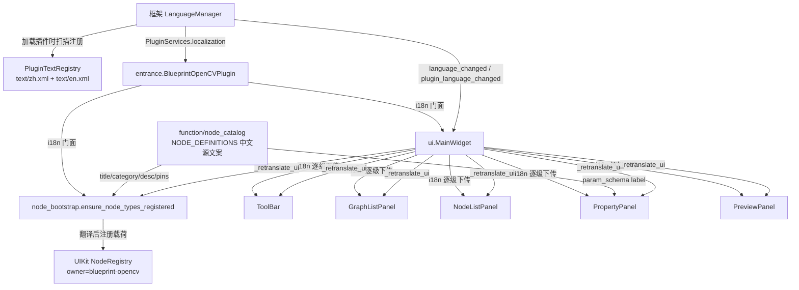
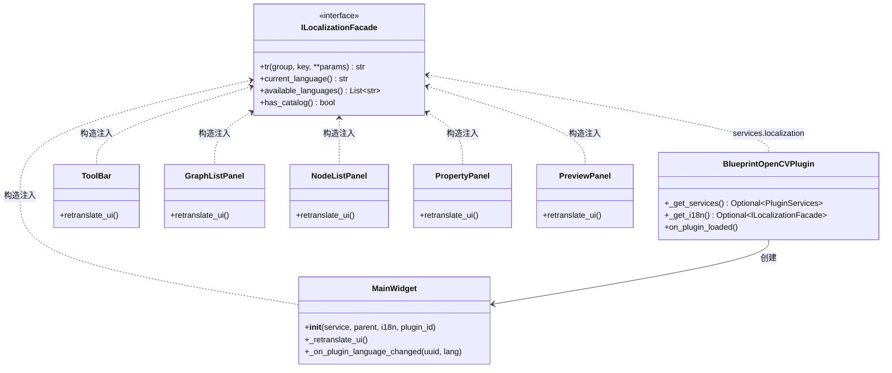

# SPEC — blueprint_opencv 多语言（i18n）改造技术方案

- 创建日期：2026-08-22
- 修改日期：2026-08-22
- 对应 PRD：`PRD-i18n-blueprint_opencv-20260822.md`

## 1. 技术方案总览

插件新增 `text/zh.xml` 与 `text/en.xml` 两份语言文件（框架加载插件时自动扫描注册，插件无登记代码）。全部用户可见静态文案改为经 `ILocalizationFacade.tr(group, key, **params)` 取词；门面由框架经 `PluginServices.localization` 注入，entrance 取得后下传 UI 层。语言切换由 MainWidget 监听框架信号并集中重翻译。

## 2. 关键设计决策（Why）

### D1：节点元数据在「UI 展示边界」取词，function 层零改动

节点标题 / 描述 / 分类 / 引脚名 / 参数标签的唯一来源是 `function/node_catalog.py` 的 `NODE_DEFINITIONS` 纯数据表（中文字面量）。候选方案：

- **方案 A（采用）**：NODE_DEFINITIONS 保持中文原样作为 zh 源文案；翻译发生在两个 UI 边界——
  1. `ui/node_bootstrap.py` 把定义注册进 UIKit `NodeRegistry` 时，对 title / category / description / 引脚 name 逐项取词；
  2. `ui/property_panel.py` 按 schema 重建表单时，对参数 label 取词（键 `param.{type_name}.{param_key}`）。
- 方案 B（弃用）：给 node_catalog / BlueprintOpenCVService 增加 i18n 参数。缺点：NODE_DEFINITIONS 是模块级冻结 dataclass 表，注册时机早于门面可用（main_widget 模块级即注册）；改造会扩散到 executor / graph_migration 等全部消费方，违背最小化改动。

**理由**：A 方案 function 层不引入任何新依赖（继续无 Qt、无 i18n），service_api（`list_node_types` 返回中文定义）语义完全不变；翻译集中在 ui 层两处边界，键命名机械可控。

### D2：choice 选项值、节点状态枚举不翻译显示原文

choice 参数 options（`gaussian` / `binary` / `fixed`…）与节点状态（`idle` / `running` / `done` / `error`）是**随图序列化持久化的内部标识符**，属性面板下拉框原样显示可避免「显示文案 ≠ 存储值」的映射复杂度。节点状态在节点列表 / 属性面板显示时经 `status.*` 键翻译（显示层翻译，不动数据）；choice 选项值保持原文（决策记录：属内部标识符，且改动会破坏既有存档兼容性）。

### D3：service_api 返回的中文错误文案不国际化

`run_pipeline` / `save_graph` 等返回 `{"success": False, "error": "中文原因"}`，information.py 的 service_api 声明明确「失败时含 error（中文原因）」，属跨插件 API 契约；改造会破坏该契约且 MCP 调用方无语言上下文。UI 层自行生成的标题 / 状态模板（如 `fail.save` = 保存失败）正常取词，service 返回的 reason 原样拼接展示。

### D4：重翻译集中在 MainWidget，子面板各暴露 `retranslate_ui()`

框架不替插件重绘 UI。MainWidget 构造时连接：

- `LanguageManager.language_changed` → `_retranslate_ui()`；
- `LanguageManager.plugin_language_changed(plugin_id, lang)` → 比对 `self._plugin_id` 后 `_retranslate_ui()`。

`_retranslate_ui()` 依次：重设面板分区标题 → `toolbar.retranslate_ui()` → `graph_list_panel.retranslate_ui()`（内部 refresh 重建行）→ `node_list_panel.retranslate_ui()`（刷新全部行）→ `property_panel.retranslate_ui()`（重建当前绑定表单）→ `preview_panel.retranslate_ui()` → `ensure_node_types_registered(i18n)` 按新语言重注册节点类型（菜单 / 新建节点生效）。

**已知限制（明示）**：已存在于画布的节点实例标题不随语言切换改写——节点标题是实例数据（用户可经「重命名」修改），改写会覆盖用户命名；新建节点与右键菜单立即使用新语言。存档文件名、状态栏历史消息等动态内容不回溯刷新（生成时已取词）。

### D5：注册幂等比较扩展标题/分类/引脚名

`node_bootstrap._spec_matches` 原本只比对引脚 `(id, data_type)`。语言切换后同一 type_name 的 title/category/引脚名不同，需要重注册纠正，故一致性比较扩展为「引脚 id/data_type + 引脚 name + title + category」：同语言重复调用仍幂等跳过，语言变化时同名异定义纠正机制自然完成重注册并记 WARNING。WARNING 文案区分「语言切换重注册」属正常路径，日志降级为 INFO（语言切换时）以保持日志语义准确——实现上把「被旧定义覆盖纠正」与「语言切换重注册」统一为重新注册，日志保留 WARNING 但在消息中注明可能由语言切换触发。

### D6：门面未注入时优雅降级

每个取词类定义 `_tr(group, key, **params)` 辅助方法：`self._i18n is None` 时返回键名（正常加载路径框架始终注入，独立运行 / 冒烟场景不崩溃）。所有构造函数新增的 `i18n` / `plugin_id` 参数默认 `None`，向后兼容既有调用。

## 3. 目录结构与模块划分

```
plugin/blueprint_opencv/
  text/
    zh.xml                  # 新增：默认语言，覆盖全部键（回退终点）
    en.xml                  # 新增：同键集合英文翻译
  entrance.py               # 修改：_get_services() 取 localization，注入注册与 MainWidget
  ui/
    node_bootstrap.py       # 修改：ensure_node_types_registered(i18n=None)，注册载荷翻译
    main_widget.py          # 修改：i18n/plugin_id 入参、_retranslate_ui、信号连接
    toolbar.py              # 修改：i18n 入参、retranslate_ui()
    graph_list_panel.py     # 修改：i18n 入参、retranslate_ui()、行/对话框取词
    node_list_panel.py      # 修改：i18n 入参、retranslate_ui()、状态名翻译
    property_panel.py       # 修改：i18n 入参、retranslate_ui()、param 标签取词
    preview_panel.py        # 修改：i18n 入参、retranslate_ui()、info 模板取词
  function/                 # 不变（D1）
  service.py / information.py / config/  # 不变（D3）
  IXPlugin.json             # 修改：name/description 多语言字典
```

## 4. 数据流向



## 5. 类与接口关系



## 6. 涉及修改的描述文件与配置项

- `IXPlugin.json`：`name` → `{"zh": "Blueprint OpenCV", "en": "Blueprint OpenCV"}`（品牌名双语一致）；`description` → zh 沿用现有中文、en 新译。`version` 保持 `release.1.0.3`，其余字段不动。
- 新增 `text/zh.xml` / `text/en.xml`（框架自动扫描，无需登记）。
- 不新增 / 不修改任何 config 配置项；`config/default.json` 不变。

## 7. 分组 / 键命名约定

- group 按 UI 结构划分：`toolbar` / `panel`（分区标题）/ `main`（MainWidget 状态与对话框）/ `graph_list` / `node_list` / `property` / `preview` / `status`（节点状态名）/ `nodes`（节点标题与描述）/ `categories`（节点分类）/ `pins`（引脚名）/ `params`（参数标签）/ `node_body`（节点体区）。
- 键名点分、自解释：`nodes` 组内 `node.{type_name}.title` / `node.{type_name}.desc`；`params` 组内 `param.{type_name}.{param_key}`（type_name 消歧：load_image 与 save_image 的 file_path 标签不同）；`categories` 组内 `{category_key}`（category_key 由 node_bootstrap 的「分类中文 → 键」映射表给出：输入→input、基础→basic、滤波→filter、阈值与边缘→threshold、形态学→morphology、调整→adjust、输出→output）；`pins` 组内 `pin.exec` / `pin.image`。
- 占位符仅命名式：如 `main.status.saved` = `已保存「{name}」（{count} 个节点）`。
- zh.xml 为全量参照，en.xml 键集合必须与之完全一致（`check_i18n_completeness.py` 校验）。
