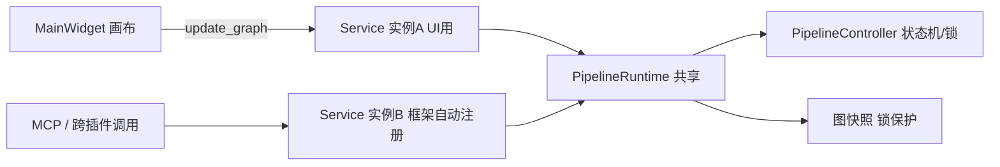
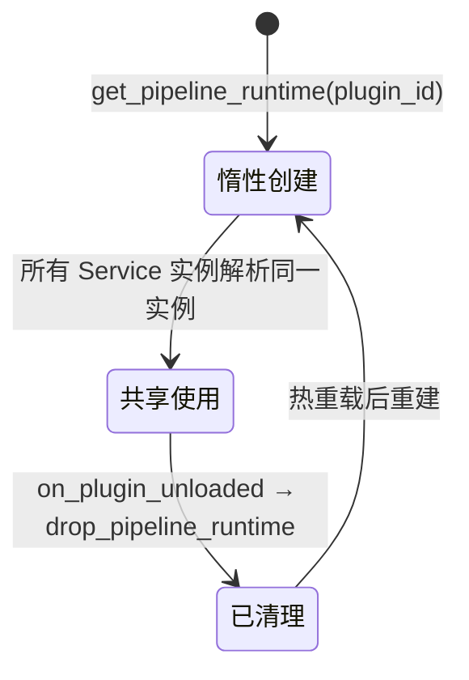

# SPEC：双 Service 实例共享管线运行态

- 创建日期：2026-08-24
- 修改日期：2026-08-24

## 技术方案与决策（Why）

框架自动注册在 `on_plugin_loaded()` 之后执行且会覆盖 `_api_registry[plugin_id]`，插件无法通过「手动注册自己的实例」抢占注册表。因此采用**共享运行实例**方案：在 function 层新增 `runtime_registry` 模块，以 `plugin_id` 为键提供进程内唯一的 `PipelineRuntime`（`PipelineController` + 图快照），所有 Service 实例在构造时解析同一 runtime。这样无论框架注册的是哪个实例，跨插件 / MCP 调用与 UI 都操作同一份运行态。

备选方案（未采用）：

- 框架侧修改自动注册复用插件实例——需走框架仓库流程，本次明确不碰框架代码；
- Service 类属性共享——违反「禁模块级全局状态」的规范精神且不可按 plugin_id 隔离。

## 模块划分

```
function/
└── runtime_registry.py   # 新增：PipelineRuntime（控制器 + 图快照，锁保护）
                          #   + get_pipeline_runtime / drop_pipeline_runtime
service.py                # 改造：_controller/_graph_snapshot → _runtime（共享）
entrance.py               # 改造：on_plugin_unloaded 增加 drop_pipeline_runtime 清理
ui/main_widget.py         # 修复：_on_run_finished 取 errors[0]["message"]
```

`EMPTY_GRAPH` 常量由 service.py 迁入 runtime_registry.py（唯一使用方）。

## 数据流向



## 生命周期



## 兼容性

- service_api 九方法签名与返回结构不变；`update_graph` / `current_graph` / `shutdown` 语义不变；
- 并发语义变化（正向修复）：UI 运行中 MCP 提交 run_pipeline 现在会被「已有运行中」拦截，而非双实例并发跑两条管线。

## 验证

`temp/bp_shared_runtime_smoke.py`（冒烟脚本）：双实例共享断言、MCP save_graph 内容断言、运行占用拦截断言、drop 重建断言，全部通过。
