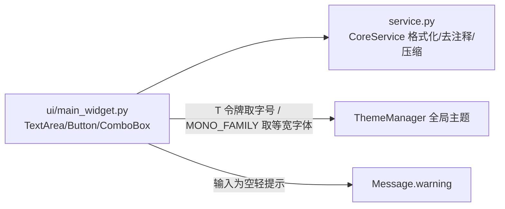

# SPEC：code_formatter UI 迁移至 InstructionX_UIKit

- **创建日期**：2026-07-29
- **修改日期**：2026-07-29

## 1. 技术方案与设计决策（Why）

| 决策 | 理由 |
|---|---|
| 整体删除插件 QSS（`style/main_widget.qss`） | UIKit 组件默认样式 + 全局 `build_qss` 已覆盖全部控件样式并自动跟随亮/暗主题，插件级 QSS 不再需要 |
| 标题用 `QFont` + `T("font.lg")` 而非 QSS | 禁止硬编码字号；令牌随主题实时生效 |
| `TextArea` 设置 `QFont(MONO_FAMILY)` | 代码输入/展示需等宽对齐；字体名取自 UIKit 令牌而非硬编码 |
| `Button(variant="primary")` 承载主操作「格式化 JSON」 | UIKit 语义：主操作使用 primary 变体；「移除注释」「压缩代码」为次要操作，用 default |
| `QMessageBox.warning` → `Message.warning(self, text)` | 3 处均为「输入为空」的结果告知，属轻提示场景；`Message` 以 self 为锚点相对父窗口定位，无需 Dialog |
| 版本号 release.1.0.0 → release.1.1.0 | UI 重构属功能层面改进，升级小版本 |

## 2. 控件映射

| 原控件 | 新控件 |
|---|---|
| `QTextEdit`（代码输入区） | `TextArea(placeholder=...)` + `QFont(MONO_FAMILY)` |
| `QPushButton("格式化 JSON")` | `Button("格式化 JSON", variant="primary")` |
| `QPushButton("移除注释")` | `Button("移除注释")` |
| `QPushButton("压缩代码")` | `Button("压缩代码")` |
| `QComboBox`（语言选择） | `ComboBox(languages)` |
| `QMessageBox.warning`（3 处） | `Message.warning(self, text)` |
| `QLabel` 标题（QSS heading） | `QLabel` + `QFont(T("font.lg"), Bold)` |

## 3. 数据流向

## 4. 涉及修改的文件

- `ui/main_widget.py`：UIKit 迁移（删除样式加载样板与 `hideEvent`）；
- `information.py` / `IXPlugin.json`：version → `release.1.1.0`；
- 删除：`style/` 目录、`__pycache__/`；
- 不变：`entrance.py`、`service.py`、`function/`、`config/default.json`、`service_api`。

## 5. 验证

离屏脚本 `temp/verify_batch1.py code_formatter` 实例化 MainWidget 并做亮/暗主题切换；另调用 `CoreService.format_json` 冒烟确认业务逻辑未破坏。
