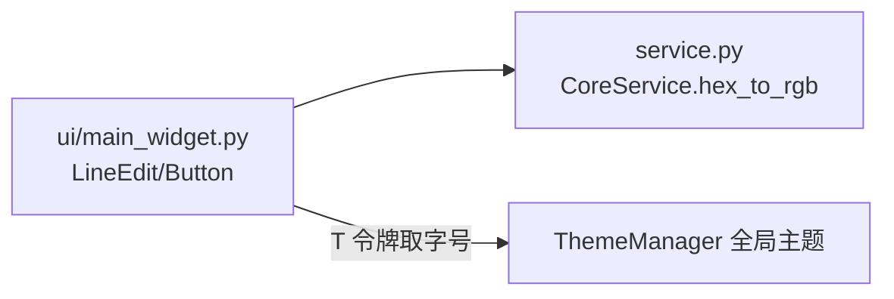

# SPEC：color_converter UI 迁移至 InstructionX_UIKit

- **创建日期**：2026-07-29
- **修改日期**：2026-07-29

## 1. 技术方案与设计决策（Why）

| 决策 | 理由 |
|---|---|
| 整体删除插件 QSS（`style/main.qss`） | 其选择器 `ColorConverterWidget[heading="true"]` 指向不存在的类名且硬编码 `#333`，本就无效；UIKit 组件默认样式 + 全局 `build_qss` 已覆盖全部控件样式并自动跟随亮/暗主题 |
| 标题用 `QFont` + `T("font.lg")` 而非 QSS | 禁止硬编码字号；令牌随主题实时生效 |
| `Button(variant="primary")` 承载主操作「转换」 | UIKit 语义：主操作使用 primary 变体 |
| 版本号 release.1.0.0 → release.1.1.0 | UI 重构属功能层面改进，升级小版本 |

## 2. 控件映射

| 原控件 | 新控件 |
|---|---|
| `QLineEdit`（HEX 输入） | `LineEdit(placeholder=..., clearable=True)` |
| `QLineEdit`（RGB 输出，只读） | `LineEdit(placeholder=...)` + `setReadOnly(True)` |
| `QPushButton("转换")` | `Button("转换", variant="primary")` |
| `QLabel` 标题（QSS heading） | `QLabel` + `QFont(T("font.lg"), Bold)` |

## 3. 数据流向

## 4. 涉及修改的文件

- `ui/main_widget.py`：UIKit 迁移（删除样式加载样板）；
- `entrance.py`：修正返回类型标注（`"QWidget"` 字符串 → 顶部导入 `QWidget`）；
- `information.py` / `IXPlugin.json`：version → `release.1.1.0`；
- 删除：`style/` 目录。

## 5. 验证

离屏脚本实例化 MainWidget 并触发转换逻辑；真机运行主程序确认插件加载与界面打开、亮暗主题切换正常。
