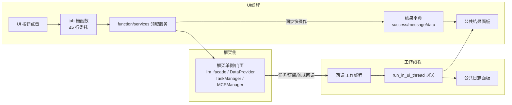
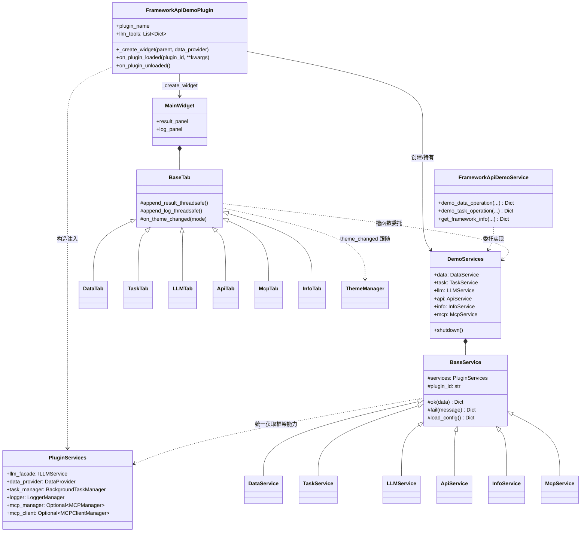
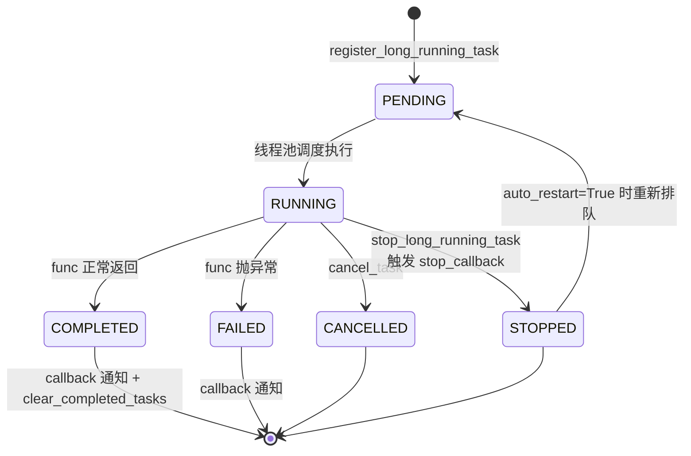

# SPEC — framework_api_demo 框架全 API 覆盖改造技术方案

- 创建日期：2026-07-30
- 修改日期：2026-07-30
- 插件：framework-api-demo（release.1.1.0 → 建议 release.1.2.0，待开发者确认）
- 文档类型：技术规格说明书（SPEC）
- 配套文档：`PRD-full-api-coverage-20260730.md`

---

## 1. 技术方案与设计决策（Why）

### 1.1 为什么改为 PluginServices 构造注入

框架加载插件的主路径是：PluginManager 实例化入口类时传入 `services: PluginServices`（dataclass：`llm_facade` / `data_provider` / `task_manager` / `logger` / `mcp_manager` / `mcp_client`），并注入 `_services` / `_plugin_id` / `_plugin_dir` 实例属性。示例插件的职责是示范**主路径**，而不是绕过它自行 import 框架单例。改为构造注入后：

- 服务层对框架的依赖收敛为一个入口（PluginServices），可测试性更好（测试时可注入替身）；
- `mcp_manager` / `mcp_client` 为 `Optional`，注入路径天然要求做空值降级处理，示范了健壮写法；
- 与框架文档及其他示例插件（llm-chat 等）的推荐用法一致。

### 1.2 为什么 LLM 全部走 llm_facade（ILLMService）

`ILLMService`（实现 `core/llm/plugin_service.py` 的 `LLMPluginService`）是框架对插件承诺的**稳定契约**；`LLMProvider` 单例是框架内部实现细节，其接口不受插件兼容性约束。示例插件直接调 LLMProvider 属于方向性错误：它会教坏读者，并在框架内部重构时无声损坏。改造后 chat / stream_chat / embed / 会话 / 工具调用 / 多模态 / 统计全部经 `services.llm_facade`，插件代码只依赖 `core/interfaces/i_llm_service.py` 的契约。

### 1.3 为什么拆包（ui/tabs/ 与 function/services/）

- `ui/main_widget.py` 871 行、承载 5+ 个互不相关的演示主题，违反「单文件一个内聚主题」；拆为 `ui/tabs/` 后每个 tab 一个文件，`main_widget` 退化为布局壳 + 公共结果/日志面板；
- `function/services/core_service.py` 442 行且随第二批大幅增长，按演示领域拆为 base / data / task / llm / api / info / mcp 七个模块，`__init__.py` re-export 保持外部引用稳定；
- 拆包后每个文件天然满足方法 ≤20 行、类单一职责的硬约束，也为第二批新增页（mcp_tab 等）提供落点，避免继续往巨型文件里堆代码。

### 1.4 其他关键决策

- **service.py 实体类**：框架的自动注册机制要求 `service.py` 中存在以 `Service` 结尾的类，且构造签名按 `(plugin_id, data_provider, llm_service, task_manager)` 递减注入探测。实体类 `FrameworkApiDemoService` 遵循该签名，内部委托 `function/services/` 实现，保持对外三方法签名不变（向后兼容）。
- **工作线程回调统一封送**：DataProvider 订阅回调、任务回调、流式回调均在工作线程触发，所有 UI 更新统一经 `utils.thread_utils.run_in_ui_thread` 封送，封装在 `base_tab` 的 `_append_result_threadsafe` / `_append_log_threadsafe` 中，避免各 tab 重复手写。
- **卸载清理集中在 entrance**：`on_plugin_unloaded` 调用服务层的 `shutdown()`（取消全部订阅、注销演示插件命名空间、停止并注销定时任务），保证热卸载无残留。
- **配置真实消费**：`config/default.json` 仅保留代码真实读取的键；`task.interval_range`（min/max/default）由 `task_service` 读取并注入 UI 控件范围，替代硬编码 5/3600/60；`ui` / `plugin` 段**移除**（评估后无真实消费需求，保留即死配置）。
- **错误处理模式**：沿用既有 `{"success": bool, "message": str, "data": ...}` 结果字典模式；异常处捕获后写入结果字典 + LoggerManager 记录（含 `traceback.format_exc()` 堆栈，因 LoggerManager 不支持 exc_info），禁止裸 except。

---

## 2. 目标目录结构

```
plugin/framework_api_demo/
├── IXPlugin.json                  # 不变（仅版本字段随发版更新）
├── README.md                      # 全面修订（FR-7 / NFR-5）
├── __init__.py                    # 不变
├── entrance.py                    # PluginServices 构造注入；on_plugin_unloaded 清理；llm_tools 属性（FR-9）
├── information.py                 # service_api 声明不变；版本随发版更新
├── service.py                     # FrameworkApiDemoService 实体类（Service 结尾，递减注入签名）
├── assets/                        # 不变
├── icons/                         # 不变
├── config/
│   └── default.json               # 清理死配置；task.interval_range 真实消费；version 对齐
├── docs/                          # 既有 + 本批次 req 文档
├── function/
│   ├── __init__.py                # re-export
│   ├── services/
│   │   ├── __init__.py            # re-export DemoServices 门面
│   │   ├── base.py                # BaseService：PluginServices 持有、结果字典、日志辅助、配置读取
│   │   ├── data_service.py        # DataProvider 演示（含发布订阅 FR-4）
│   │   ├── task_service.py        # 任务演示（普通/长期/定时/取消 FR-5）
│   │   ├── llm_service.py         # llm_facade 演示（chat/stream/embed/会话/工具/多模态/统计 FR-3/6/8/9/11）
│   │   ├── api_service.py         # 跨插件 API 与 PluginManager 查询演示（FR-7 实体实现 + get_all_apis 等）
│   │   ├── info_service.py        # 框架信息/工具类演示（FontMap/Logger/image_utils/封送 FR-12）
│   │   └── mcp_service.py         # MCP manager/client 演示（FR-10）
│   └── tools/
│       ├── __init__.py
│       └── demo_tools.py          # 演示用 LLM 工具定义与注册（FR-9）
└── ui/
    ├── __init__.py
    ├── main_widget.py             # 布局壳：QTabWidget 装配 + 公共结果/日志面板
    └── tabs/
        ├── __init__.py
        ├── base_tab.py            # BaseTab：公共结果/日志面板访问、线程安全追加、主题跟随基座
        ├── data_tab.py            # 数据演示页（FR-4）
        ├── task_tab.py            # 任务演示页（FR-5）
        ├── llm_tab.py             # LLM 演示页（FR-3/6/8/9/11）
        ├── api_tab.py             # 跨插件 API 演示页（FR-7 + PluginManager 查询）
        ├── mcp_tab.py             # MCP 演示页（FR-10，第二批新增）
        └── info_tab.py            # 信息与工具演示页（FR-12）
```

说明（与任务书结构的微调）：

- `function/services/core_service.py` 删除，由 `base.py` + 六个领域模块取代；对外通过 `services/__init__.py` re-export 的 `DemoServices` 门面访问，entrance/ui 只依赖门面；
- 新增 `function/tools/demo_tools.py`：FR-9 的工具定义属业务逻辑，放 function/ 而非 ui/；
- `llm_service.py` 若随第二批增长超限，可在包内再拆 `llm/conversation_service.py` 等子模块（保持 `__init__` re-export 不变），本 SPEC 先按单文件规划。

---

## 3. 数据流向



要点：

- tab 槽函数只做参数收集与一行服务调用（≤5 行），不碰框架 API；
- 服务层返回统一结果字典，tab 负责渲染；
- 所有异步回调（DataProvider subscribe、任务 callback/status_callback、stream_chat callback）先记录线程上下文，经 `run_in_ui_thread` 回到 UI 线程后更新面板；
- MCP/LLM 等可能较慢的同步门面调用，经 `task_manager.register_sync_task` 包裹执行，避免阻塞 UI。

---

## 4. 类与接口关系



---

## 5. 状态机设计（长期任务生命周期）



说明：

- `status_callback` 在每次状态迁移时由框架于工作线程触发，演示页经 `run_in_ui_thread` 刷新状态标签；
- 普通（非长期）任务不含 STOPPED；定时任务生命周期独立（enable/disable/unregister），在任务页以列表形式演示；
- 状态字面量以框架 `BackgroundTaskManager` 实际返回值为准，UI 不做硬编码比较之外的臆测。

---

## 6. 涉及修改的描述文件与配置项清单

| 文件 | 改动 |
|------|------|
| `IXPlugin.json` | 仅 `version`（建议 1.2.0，待开发者确认），结构不变 |
| `information.py` | 版本常量更新；service_api 三方法声明保留、描述文案与实现对齐 |
| `service.py` | 新增 `FrameworkApiDemoService` 实体类（递减注入签名），实现三方法 |
| `entrance.py` | 构造注入 PluginServices；新增 `on_plugin_unloaded`；新增 `llm_tools` 属性 |
| `config/default.json` | 移除 `ui` / `plugin` 死配置段；`version` 对齐；`task.interval_range`（min/max/default）被 task_service 真实读取；保留已有被消费键 |
| `README.md` | 文件结构、版本号、功能清单全面修订，删除未实现的声称条目 |
| `function/services/` | core_service.py 拆为 base/data/task/llm/api/info/mcp + `__init__` re-export |
| `function/tools/demo_tools.py` | 新增：演示工具定义与注册（FR-9） |
| `ui/main_widget.py` | 瘦身为布局壳 + 公共面板 |
| `ui/tabs/` | 新增包：base/data/task/llm/api/mcp/info 七个 tab |

---

## 7. 分批实施计划（每项一个 commit）

> commit 信息格式 `<type>(framework_api_demo): 中文描述`；是否使用自定义前缀需提交前向开发者确认。

### 第一批（纠偏 + 补核心）

| # | 内容 | 建议 commit |
|---|------|------------|
| 1 | FR-1 UI 拆分为 ui/tabs 包 | `refactor(framework_api_demo): 拆分 main_widget 为 ui/tabs 包，主组件退化为布局壳与公共面板` |
| 2 | FR-2 PluginServices 注入 + 服务层拆包 + on_plugin_unloaded | `refactor(framework_api_demo): 改为 PluginServices 构造注入并拆分服务层，新增卸载清理` |
| 3 | FR-3 LLM 演示改走 llm_facade | `fix(framework_api_demo): LLM 演示统一改经 llm_facade 门面，移除 LLMProvider 单例直调` |
| 4 | FR-4 DataProvider 发布订阅演示 | `feat(framework_api_demo): 新增 DataProvider 发布订阅演示（工作线程回调封送 UI）` |
| 5 | FR-5 任务演示补全 | `feat(framework_api_demo): 补全长期任务、取消、完成回调与定时任务启停注销演示` |
| 6 | FR-6 stream_chat 流式演示 | `feat(framework_api_demo): 新增 stream_chat 流式聊天逐步刷新演示` |
| 7 | FR-7 service_api 实体 + 配置/README 修复 | `fix(framework_api_demo): 补齐 service_api 三方法实体实现并修复 README 与配置一致性` |

### 第二批（补全）

| # | 内容 | 建议 commit |
|---|------|------------|
| 8 | FR-8 会话管理演示 | `feat(framework_api_demo): 新增会话管理全流程演示（创建/发送/流式/查询/删除）` |
| 9 | FR-9 工具调用演示 | `feat(framework_api_demo): 新增共享工具注册、chat_with_tools 与 llm_tools 声明演示` |
| 10 | FR-10 MCP 演示页 | `feat(framework_api_demo): 新增 MCP Server/Client 演示页与 service_api 桥接说明` |
| 11 | FR-11 多模态与统计演示 | `feat(framework_api_demo): 新增图像生成、语音合成、用量统计与 Provider 校验演示` |
| 12 | FR-12 工具与主题演示 | `feat(framework_api_demo): 新增线程封送、FontMap、主题跟随、分级日志与图片转 base64 演示` |

实施纪律：

- 每个 commit 前运行插件所在应用做即时验证（对应 tab 可点、结果面板有输出、热卸载无残留）；
- 顺序上 FR-1 → FR-2 为后续一切的结构性前置，必须先完成；FR-3 ~ FR-7 在拆分后的结构上逐页填充；
- 全部完成后统一复核 README 与 default.json 一致性，再随发版更新版本号（需开发者确认）。

---

## 8. 风险与注意事项

- `mcp_manager` / `mcp_client` 为 Optional：MCP 页必须做空值降级（面板提示「框架未注入 MCP 能力」），不得 AttributeError；
- MCPClientManager 的 connect/disconnect/list_connected_servers/list_tools 为**同步方法**，演示代码禁止 await；
- LoggerManager 不支持 exc_info 参数，异常演示需自行 `traceback.format_exc()` 拼入 message；
- DataProvider subscribe 的 `demo_plugin_id` 采用既有确定性哈希机制生成，改造不得改变该算法，否则已存数据命名空间漂移；
- service_api 三方法对外签名与返回结构保持不变，仅填充实现（跨插件调用方与 MCP 工具消费者不受影响）。
