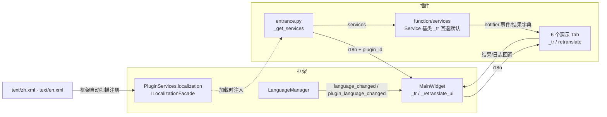
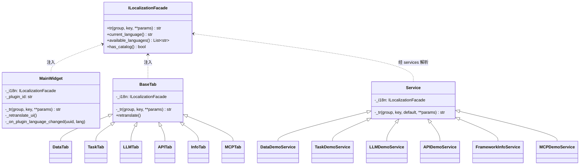

# SPEC — framework_api_demo 多语言（i18n）改造技术方案

- 创建日期：2026-08-22
- 修改日期：2026-08-22
- 对应 PRD：`PRD-i18n-framework_api_demo-20260822.md`

## 1. 技术方案与设计决策（Why）

### D1 取词入口：门面注入，UI 与服务两层各自 `_tr`

框架在加载插件时经 `PluginServices.localization` 注入绑定本插件 UUID 的
`ILocalizationFacade`（始终注入，但字段类型 Optional，需判空）。

- **UI 层**：entrance 经既有 `_get_services()` 取 `services.localization`，
  连同 `plugin_id` 传入 `MainWidget(i18n=..., plugin_id=...)`，MainWidget 再
  逐级传给 6 个 Tab 构造函数（均新增默认值 `None` 的可选参数，向后兼容）。
  每个类定义统一辅助方法：

  ```python
  def _tr(self, group: str, key: str, /, **params) -> str:
      """取插件文案；门面未注入时优雅降级返回键名（正常加载路径框架始终注入）"""
      if self._i18n is None:
          return key
      return self._i18n.tr(group, key, **params)
      ```

- **服务层**：6 个演示服务构造函数已接收 `services`，基类
  `function/services/base.py` 的 `Service.__init__` 内解析
  `self._i18n = services.localization`（判空），并提供带回退的 `_tr`：

  ```python
  def _tr(self, group: str, key: str, /, default: str = "", **params) -> str:
      """取服务层文案；门面未注入时回退中文默认文案（API/MCP 调用路径不保证注入门面）"""
      if self._i18n is not None:
          return self._i18n.tr(group, key, **params)
      return default.format(**params) if default else key
      ```

  **Why 服务层回退中文默认文案而非键名**：`service.py` 的
  `FrameworkApiDemoService` 由 PluginManager 递减注入
  （plugin_id/data_provider/llm_service/task_manager），**无 localization
  注入路径**，其惰性创建的委托服务（DataDemoService 等）经跨插件 API / MCP
  工具被外部调用时门面恒为 None；若回退键名，API 调用方会看到裸键，
  属于可见回归。默认文案参数保持无门面路径行为与改造前一致。

### D2 语言切换刷新：集中 `_retranslate_ui()` + 各 Tab `retranslate()`

框架不替插件重绘 UI。MainWidget 构造时连接两个信号：

```python
get_language_manager().language_changed.connect(self._retranslate_ui)
get_language_manager().plugin_language_changed.connect(self._on_plugin_language_changed)
```

- `language_changed`：框架语言变化，直接全量重翻译；
- `plugin_language_changed(uuid, lang)`：回调内比对 `self._plugin_id`
  （entrance 的 `self.plugin_id`），命中本插件才重翻译。

刷新策略为**就地重设**（不重建 Widget 树，保留输入框内容与结果/日志历史）：
为此把原先作为局部变量创建的按钮/分组改为实例属性（`self.xxx`），
表单行标签由 `addRow("键:", w)` 改为显式 `QLabel` 实例属性 +
`addRow(label, w)`，`_retranslate_ui()` 中逐个 `setText`/`setTitle`。
动态内容（任务列表行、会话列表行、notifier 事件）在生成时取词，
语言切换不回溯刷新历史条目；结果面板历史卡片不刷新（与主题切换的既有约定一致）。

### D3 文案提取边界

- **提取**：UI 标签、按钮、分组标题、占位提示、Tab 名、结果面板标题、
  日志面板消息模板、Message 弹窗、MCP 桥接说明文本、API 文档展示文本、
  服务层面向用户的 message/error/notifier 事件模板；
- **不提取**：LoggerManager 日志（保持中文）、异常 `str(e)`、
  内部协议前缀（`STREAM_CHUNK_PREFIX` 等事件分发协议，UI 依赖其解析）、
  任务类型标识符（sync/async/scheduled/long_running）、框架枚举 status.value、
  工具定义 JSON（`function/tools/demo_tools.py` 的 description 为发给 LLM 的
  function calling schema，属模型侧契约而非界面文案）、
  `information.py` 的 service_api 描述（跨插件 API 契约文本）。

### D4 service.py 不变更

`FrameworkApiDemoService` 的三条参数校验错误文案
（缺 key / 缺 task_id / 未知操作类型）无门面注入路径（见 D1），
且属跨插件 API 级错误文本而非本插件 UI 渲染文案；
强行提取需改动 PluginManager 注入签名，超出最小化改动范围。
保持硬编码中文，作为已知取舍记录。

### D5 Tab 名称翻译

右侧 6 个 Tab 原显示英文短标签（Data/Task/LLM/API/Info/MCP）。
zh.xml 中 Data→数据、Task→任务、Info→信息，LLM/API/MCP 为技术缩写保持原形；
en.xml 保持原英文。这是本改造中唯一“zh 文案与改造前显示不同”的点，
属 i18n 本意（默认语言 zh 下给中文用户中文标签）。

### D6 IXPlugin.json 多语言字段

`name`: `{"zh": "Framework API Demo", "en": "Framework API Demo"}`
（品牌名保持英文，框架 `resolve_i18n_field` 支持字典形式）；
`description`: zh 沿用现有中文文案，en 新译。其余字段不动，版本号不变。

## 2. 目录结构与模块划分

```
plugin/framework_api_demo/
├── text/                        # 新增：插件语言包（框架自动扫描注册）
│   ├── zh.xml                   # 中文（回退终点，必须全覆盖）
│   └── en.xml                   # 英文（全量翻译）
├── entrance.py                  # 注入 i18n/plugin_id；启动日志取词
├── ui/
│   ├── main_widget.py           # _tr/_retranslate_ui/信号连接；面板与 Tab 名
│   └── tabs/
│       ├── base_tab.py          # BaseTab 接收 i18n，提供统一 _tr 与 retranslate 钩子
│       ├── data_tab.py          # 各 Tab：文案取词 + retranslate()
│       ├── task_tab.py
│       ├── llm_tab.py
│       ├── llm_tab_groups.py    # 多模态/统计分组 mixin，同法取词
│       ├── api_tab.py
│       ├── info_tab.py
│       └── mcp_tab.py
└── function/services/
    ├── base.py                  # 解析 services.localization；服务层 _tr（默认回退）
    ├── data_service.py / task_service.py / llm_service.py
    ├── info_service.py / mcp_service.py / api_service.py   # 用户可见模板取词
```

## 3. 数据流向



## 4. 类与接口关系



## 5. 涉及修改的描述文件与配置项

| 文件 | 变更说明 |
|------|----------|
| `IXPlugin.json` | `name` / `description` 改 `{"zh": ..., "en": ...}` 字典；version 不变 |
| `text/zh.xml` / `text/en.xml` | 新增；无需任何登记配置，框架按 `text/*.xml` 自动扫描 |

不涉及 `config/`、`data/` 等运行时文件结构变更；无新增环境变量。

## 6. 分组 / 键命名约定

- 分组按 UI 结构 + 服务域划分，共 14 组：

| group | 范围 |
|-------|------|
| `common` | 跨 Tab 复用：成功/失败后缀模板、键/值/消息/结果标签、错误前缀 |
| `main` | 主控件：结果/日志面板标题、清除按钮、6 个 Tab 名、启动日志 |
| `tab_data` / `tab_task` / `tab_llm` / `tab_api` / `tab_info` / `tab_mcp` | 各演示 Tab 的分组标题、按钮、表单标签、占位提示、结果标题、日志前缀 |
| `svc_data` / `svc_task` / `svc_llm` / `svc_info` / `svc_mcp` / `svc_api` | 服务层面向用户的 message/error/notifier 事件模板 |

- 键名点分、自解释：`group.xxx`（分组标题）、`btn.xxx`（按钮）、
  `label.xxx`（表单标签）、`placeholder.xxx`（占位提示）、
  `title.xxx`（结果面板标题）、`log.xxx`（日志前缀/模板）、
  `msg.xxx`（服务消息）、`err.xxx`（服务错误）、`warn.xxx`（弹窗警告）、
  `status.xxx` / `action.xxx`（状态/动作词）、`default.xxx`（输入框默认值）；
- 占位符仅命名式 `{name}`（str.format），禁止 `{0}` 位置式；
- zh.xml 与 en.xml 的 group 与键完全一致，以 zh.xml 为参照经
  `scripts/check_i18n_completeness.py` 校验。

## 7. 验证方案

1. `.venv/Scripts/python.exe scripts/check_i18n_completeness.py`：插件语言包无缺失；
2. 全部改动 .py 经 `python -m py_compile` 语法检查；
3. 框架根 `temp/` 临时脚本（用完删除）：`QT_QPA_PLATFORM=offscreen` 创建
   QApplication，以最小 fake facade（从插件 text/ 目录取词）实例化
   `FrameworkAPIDemoPlugin` 与 MainWidget，断言 zh/en 下关键控件文案正确、
   `_retranslate_ui()` 不抛异常；
4. 自查：无函数级 import、函数 ≤ 20 行、嵌套 ≤ 3 层。
