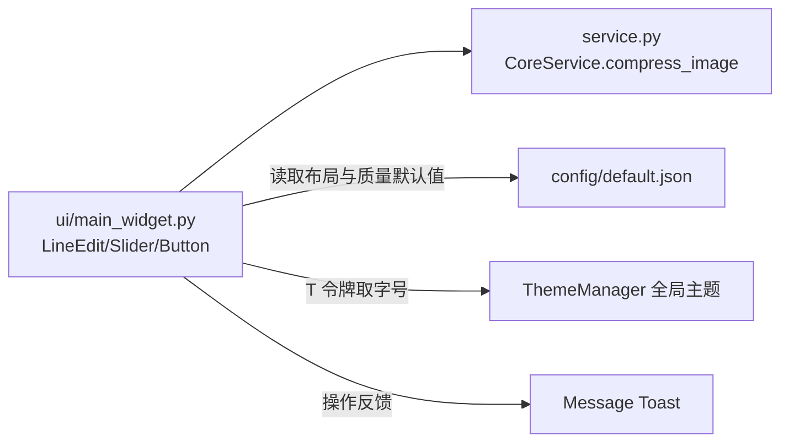

# SPEC：image_compressor UI 迁移至 InstructionX_UIKit

- **创建日期**：2026-07-29
- **修改日期**：2026-07-29

## 1. 技术方案与设计决策（Why）

| 决策 | 理由 |
|---|---|
| 整体删除插件 QSS（`style/main.qss`） | 该文件是整套硬编码深色主题（#1e1e1e 等）并自绘 QSlider groove/handle，与全局亮/暗主题冲突；UIKit 组件默认样式 + 全局 QSS 已覆盖全部控件样式并自动跟随主题 |
| `Slider` 替代自绘 QSlider | UIKit `Slider` 基于 QSlider，滑轨/手柄样式由全局 QSS 提供，且自带拖动数值气泡提示，无需插件自绘 |
| 标题用 `QFont` + `T("font.lg")` 而非 QSS | 禁止硬编码字号；令牌随主题实时生效 |
| `Button(variant="primary")` 承载主操作「压缩图片」 | UIKit 语义：主操作使用 primary 变体；「浏览...」为次要操作，使用默认变体 |
| `Message` 替代 `QMessageBox` | 3 处均为结果/校验提示（无需确认分支），用非模态 Toast 更轻量且随主题；确认型对话框才用 `Dialog` |
| `QFileDialog` 保留 | 系统文件对话框，UIKit 无替代组件 |
| 版本号 release.1.0.0 → release.1.1.0 | UI 重构属功能层面改进，升级小版本 |

## 2. 控件映射

| 原控件 | 新控件 |
|---|---|
| `QLineEdit`（文件路径输入） | `LineEdit(placeholder=..., clearable=True)` |
| `QPushButton("浏览...")` | `Button("浏览...")`（默认变体） |
| `QSlider`（质量 1-100） | `Slider(orientation=Horizontal, minimum, maximum, value)`（参数取 `config/default.json`） |
| `QPushButton("压缩图片")`（QSS class=primary） | `Button("压缩图片", variant="primary")` |
| `QLabel` 标题（QSS heading 属性） | `QLabel` + `QFont(T("font.lg"), Bold)` |
| `QMessageBox.warning/information/critical`（3 处） | `Message.warning/success/error(self, text)` |

## 3. 数据流向

## 4. 涉及修改的文件

- `ui/main_widget.py`：UIKit 迁移（删除样式加载样板，控件全部替换）；
- `information.py` / `IXPlugin.json`：version → `release.1.1.0`；IXPlugin.json description 重写为 UTF-8 简洁中文；
- 删除：`style/` 目录、全部 `__pycache__`；
- 不变：`entrance.py`、`service.py`、`function/`、`config/`、`service_api`。

## 5. 验证

离屏脚本 `temp/verify_batch1.py image_compressor` 实例化插件主控件并进行亮/暗主题切换，必须 PASS；真机运行主程序确认插件加载与界面打开、主题切换正常。
