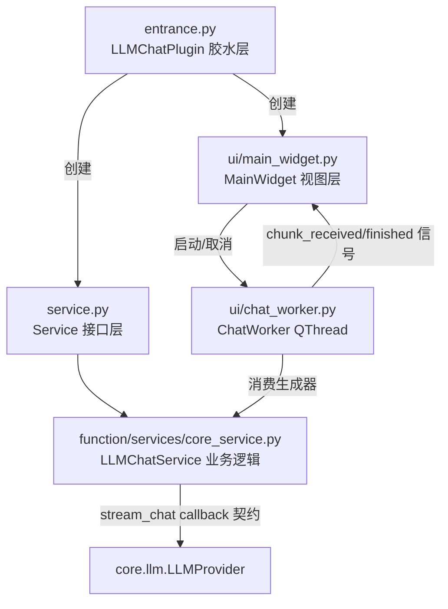
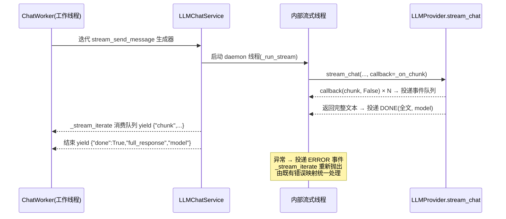

# SPEC：llm_chat UI 拆分与 InstructionX_UIKit 迁移

- **创建日期**：2026-07-29
- **修改日期**：2026-07-29

## 1. 技术方案与设计决策（Why）

| 决策 | 理由 |
|---|---|
| UI 整体迁入 `ui/main_widget.py`，`ChatWorker` 独立为 `ui/chat_worker.py` | SRP：视图层与胶水层分离；工作线程紧随其唯一消费者 MainWidget，独立文件避免主控件文件臃肿 |
| 队列 + 闭包把 callback 适配为生成器（方案一） | 保持插件内部接口稳定优先：`stream_send_message` 仍是生成器、`ChatWorker` 消费方式零改动；`stream_chat` 同步阻塞执行，callback 在其线程内同步触发，若无队列桥接则 UI 只能在流结束后一次性收到全部 chunk，丢失流式体验 |
| 异常经事件队列回投后在 `_stream_iterate` 重新抛出 | 复用 `stream_send_message` 既有 `_STREAM_ERROR_MAP` 异常映射逻辑，错误字典格式与旧版完全一致 |
| 聚合 model 取自 `LLMProvider.last_stream_response.model` | callback 契约不再逐块携带 model；框架在流结束后把聚合 model 回填到 `last_stream_response` |
| 状态标签语义样式类（`status-info` 等）随 QSS 一并删除 | 这些类只存在于被删除的插件 QSS 中；状态标签改用 UIKit `set_property(role="hint")`，状态信息由文案本身表达 |
| `_on_global_llm_changed`/`_find_main_window` 整体删除 | 主窗口 `llm_provider_changed` 信号已不存在；Provider 下拉框在 `_create_widget` 填充一次 + 「刷新模型」按钮手动刷新即可 |
| 保留局部回退常量 `_FALLBACK_PLUGIN_ID` | 只删除对 `self._plugin_id` 的覆写（失效耦合）；独立实例化（无框架注入）时 Service/DataProvider 仍需合法 id |
| `_load_preferences`（空实现）删除 | 纯 `pass` 死代码，随拆分一并清理 |
| 历史条目查看用 `Dialog.info` 而非 `Message.info` | 完整消息为长文本，轻提示 2 秒自动消失且限宽 480px，不可用；需用户手动关闭的对话框 |
| 版本号 release.1.0.0 → release.1.1.0 | UI 重构 + 流式修复属功能层面改进，升级小版本 |

## 2. 拆分结构

- `entrance.py`：`plugin_name`、`on_plugin_loaded`、`_create_widget`（注册 DataProvider 命名空间 → 创建 `Service` 与 `MainWidget` 并接线）；
- `ui/main_widget.py`：全部 UI 构建与事件处理（约 30 个方法，纯移动）；
- `ui/chat_worker.py`：`ChatWorker`，信号契约不变；
- `function/services/core_service.py`：业务逻辑，流式适配在此完成。

## 3. 流式契约修复方案（P1）

框架 `LLMProvider.stream_chat`（core/llm/llm_provider.py:929）同步执行、返回完整文本 `str`，chunk 经 `callback(text, done)` 逐块推送。修复后数据流：

选择说明：任务给出「队列/闭包转生成器」与「改 ChatWorker 消费方式」二选一，本方案取前者——保持插件内部接口（生成器契约）稳定，`ChatWorker` 与 UI 层零改动；callback 仅在事件队列投递，不直接操作 UI（UI 更新仍经 ChatWorker 的 Qt 信号封送）。

## 4. 控件映射

| 原控件 | 新控件 |
|---|---|
| `QPushButton("发送")` | `Button("发送", variant="primary")`（主操作） |
| `QPushButton("停止")` | `Button("停止", variant="danger")`（中止操作） |
| 其余 `QPushButton`（刷新模型/验证配置/添加图片/清除图片/清除对话历史） | `Button(...)` 默认变体 |
| `QComboBox`（Provider/Model/MaxTokens） | `ComboBox` |
| `QTextEdit`（输出/输入） | `TextArea`（输入框保留 keyPressEvent 覆写：Enter 发送、Shift+Enter 换行） |
| `QListWidget`（图片/历史） | `ListWidget` |
| `QSlider`（Temperature） | `Slider(minimum=0, maximum=100, value=70)` + `set_ticks(10)` |
| `QSplitter`/`QFrame`/`QGroupBox`/`QLabel`/`QScrollArea` | 保留原生 |
| `QMessageBox`（结果告知/警告/错误 ×8） | `Message.info/warning/error(self, ...)`（parent 为主控件，不再传 None） |
| `QMessageBox.question`（清除历史确认） | `Dialog.confirm(self, ..., on_result=回调)`（非阻塞 + 回调） |
| `QMessageBox.information`（历史条目完整内容） | `Dialog.info(self, title, content)`（长文本需手动关闭） |
| `QFileDialog` | 保留 |

## 5. 涉及修改的文件

- 新增：`ui/__init__.py`、`ui/main_widget.py`、`ui/chat_worker.py`；
- 重写：`entrance.py`（胶水层）；
- 修改：`function/services/core_service.py`（流式 callback 适配、`__app_llm__` 移除、import 置顶）、`information.py` / `IXPlugin.json`（version → `release.1.1.0`，description 修正为实际功能）；
- 删除：`style/` 目录、`__pycache__`。

## 6. 验证

- `.venv\Scripts\python.exe temp\verify_batch1.py llm_chat`：离屏实例化插件与主控件、亮/暗主题切换；
- `temp\smoke_llm_chat.py`：monkeypatch `LLMProvider.stream_chat` 为调用 callback 的假实现，断言 `_stream_iterate` 产出正确的 chunk 序列与聚合结果（不联网）；断言 `__app_llm__` 引用已消除。
