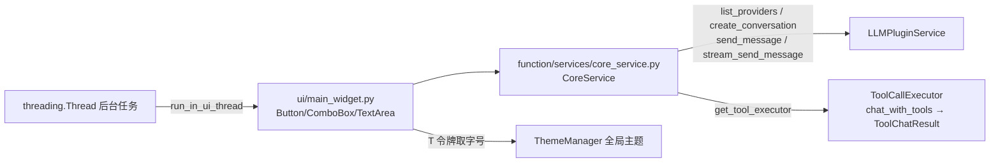

# SPEC：sample_ai_plugin UI 迁移至 InstructionX_UIKit + LLM 契约修复

- **创建日期**：2026-07-29
- **修改日期**：2026-07-29

## 1. 技术方案与设计决策（Why）

| 决策 | 理由 |
|---|---|
| 整体删除插件 QSS（`style/` 目录） | 其 `#mainWidget` 等选择器与代码 objectName（`MainWidget`）不匹配，本就无效；UIKit 组件默认样式 + 全局主题已覆盖全部控件样式并自动跟随亮/暗主题 |
| 标题用 `QFont` + `T("font.lg")` 而非 QSS `heading` 属性 | 禁止硬编码字号；令牌随主题实时生效（对齐 color_converter/string_tools 模板） |
| 三个操作按钮统一 `Button(variant="primary")` | UIKit 语义：主操作使用 primary 变体 |
| 输出区 `TextArea` + `QFont(MONO_FAMILY)` | 等宽字体便于查看流式输出与工具结果（对齐 string_tools 模板） |
| provider 下拉 itemData 存 `ProviderInfo.instance_id` 而非 `name` | 框架 provider 参数语义为实例 id（`"default"` 表示默认实例），存显示名会导致请求路由错误 |
| 后台线程 UI 更新封装 `_append_safe()`（`run_in_ui_thread`） | 裸 `threading.Thread` 内直接操作 Qt 控件会跨线程崩溃；流式路径 QThread+Signal 天然安全，保持不动 |
| `CoreService.get_available_providers()` 方法名保留，内部改调 `list_providers()` | 方法名已被 `service_api` 暴露为跨插件 API，改名会破坏兼容性；仅修正内部框架调用 |
| 版本号 release.1.0.0 → release.1.1.0 | UI 重构 + 契约修复属功能层面改进，升级小版本 |

## 2. 框架契约核对（P1 依据）

- `core/llm/plugin_service.py:565` `LLMPluginService.list_providers() -> List[ProviderInfo]`（`get_available_providers` 已删除）；
- `core/llm/types.py` `ProviderInfo` 字段：`instance_id` / `preset_id` / `name` / `adapter` / `base_url` / `enabled_chat` / `enabled_embedding` / `is_healthy` / `last_error` / `current_chat_model` / `current_embedding_model` / `models: List[ModelInfo]`；
- `core/llm/provider_interface.py:369` `ModelInfo` 字段：`id` / `name`（本插件用到）；
- `core/llm/tool_call_executor.py:156` `chat_with_tools(...) -> ToolChatResult`；
- `core/llm/types.py:176` `ToolChatResult` 字段：`messages` / `tool_results` / `final_response` / `final_text`；
- `core/llm/types.py:155` `ToolResult` 字段：`tool_name` / `arguments` / `result` / `error` / `duration_ms`。

## 3. 控件映射

| 原控件 | 新控件 |
|---|---|
| `QComboBox`（Provider / Model 选择） | `ComboBox()` |
| `QTextEdit`（输出区，只读） | `TextArea()` + `setReadOnly(True)` + `setFont(QFont(MONO_FAMILY))` |
| `QPushButton`（同步/流式/工具调用） | `Button(text, variant="primary")` |
| `QLabel` 标题（QSS `heading` 属性） | `QLabel` + `QFont(T("font.lg"), Bold)` |

## 4. 数据流向

## 5. 涉及修改的文件

- `ui/main_widget.py`：UIKit 迁移（删除样式加载样板）+ P1（ProviderInfo/ToolChatResult 适配）+ P2（线程封送）；
- `function/services/core_service.py`：`list_providers()` 适配 + import 置顶；
- `function/tools/llm_tools.py`：`datetime` import 置顶；
- `information.py` / `IXPlugin.json`：version → `release.1.1.0`；
- 删除：`style/` 目录、各级 `__pycache__`。

## 6. 验证

- `temp/verify_batch1.py sample_ai_plugin`（离屏实例化 + 亮/暗主题切换）必须 PASS；
- `temp/smoke_sample_ai.py`：断言 `list_providers` 存在、`ToolChatResult`/`ToolResult` 字段名与适配读取一致、`list_providers()` 返回对象字段访问不抛 AttributeError（无 LLM Key 可运行）。
