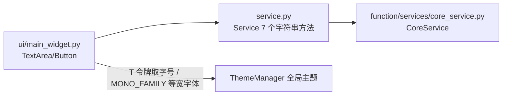

# SPEC：string_tools UI 迁移至 InstructionX_UIKit

- **创建日期**：2026-07-29
- **修改日期**：2026-07-29

## 1. 技术方案与设计决策（Why）

| 决策 | 理由 |
|---|---|
| 整体删除插件 QSS（`style/main.qss`）与 `_load_plugin_style`/`_on_destroyed` 样板 | UIKit 组件默认样式 + 全局主题已覆盖全部控件样式并自动跟随亮/暗主题，插件级 QSS 与 `QssRegistry` 已随 `utils.style_qss` 删除而失效 |
| 删除 `entrance.py` 的 `get_widget` 主题缓存覆写 | UIKit 下主题切换自动生效，无需按主题重建 widget，覆写整体删除 |
| 标题用 `QFont` + `T("font.lg")` 而非 QSS | 禁止硬编码字号；令牌随主题实时生效 |
| 文本变换按钮用 `Button(variant="primary")`，「统计信息」用默认变体 | UIKit 语义：写入输出结果区的主操作使用 primary；统计信息仅更新标签，属次要操作 |
| 输出结果区 `TextArea` 设置 `QFont(MONO_FAMILY)` | 处理结果等宽展示便于对齐查看；`MONO_FAMILY` 从 InstructionX_UIKit 顶层导入 |
| 6 个重复的 `_on_xxx` 变换槽函数收敛为 `_run_transform` | 消除复制粘贴的样板代码，保持每函数 ≤ 20 行 |
| 版本号 release.1.0.0 → release.1.1.0 | UI 重构属功能层面改进，升级小版本 |

## 2. 控件映射

| 原控件 | 新控件 |
|---|---|
| `QTextEdit`（输入文本） | `TextArea(placeholder="在此输入要处理的文本...")` |
| `QTextEdit`（输出结果，只读） | `TextArea()` + `setReadOnly(True)` + `setFont(QFont(MONO_FAMILY))` |
| `QPushButton`（转大写/转小写/反转文本/首字母大写/移除空白） | `Button(..., variant="primary")` |
| `QPushButton`（统计信息） | `Button(..., variant="default")` |
| `QLabel` 标题（QSS heading 属性） | `QLabel` + `QFont(T("font.lg"), Bold)` |
| `QLabel` 统计标签（QSS muted 属性） | 普通 `QLabel`（颜色随全局主题） |

## 3. 数据流向

## 4. 涉及修改的文件

- `ui/main_widget.py`：UIKit 迁移（删除样式加载样板，控件替换为 Button/TextArea）；
- `entrance.py`：删除 `get_widget` 主题缓存覆写与 `utils.style_qss` 函数级导入；
- `information.py` / `IXPlugin.json`：version → `release.1.1.0`；
- 删除：`style/` 目录、全部 `__pycache__`；
- 不变：`service.py`、`function/`、`information.py` 的 `service_api`、`config/default.json`。

## 5. 验证

`temp/verify_batch1.py string_tools` 离屏验证（导入、实例化、建 widget、亮/暗主题重建）PASS；另以脚本冒烟 `to_uppercase`/`reverse_text`/`count_words` 等 service 方法确认业务逻辑未破坏；真机运行主程序确认插件加载与界面打开、亮暗主题切换正常。
