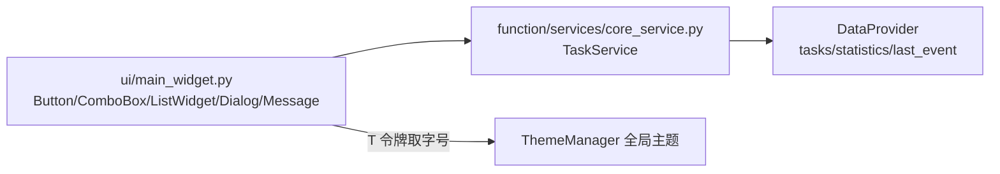

# SPEC：task_manager UI 迁移至 InstructionX_UIKit

- **创建日期**：2026-07-29
- **修改日期**：2026-07-29

## 1. 技术方案与设计决策（Why）

| 决策 | 理由 |
|---|---|
| 整体删除插件 QSS（`style/main.qss`） | 其类选择器 `TaskManagerWidget` 指向不存在的类名（无对应控件），本就无效；UIKit 组件默认样式 + 全局主题 QSS 已覆盖全部控件样式并自动跟随亮/暗主题 |
| 标题用 `QFont` + `T("font.lg")` 而非 QSS | 禁止硬编码字号；令牌随主题实时生效 |
| 主操作按钮用 `variant="primary"`、删除用 `variant="danger"` | UIKit 语义：主操作使用 primary 变体，破坏性操作使用 danger 变体 |
| `QMessageBox.question` → `Dialog.confirm(on_result=...)` | UIKit 确认对话框为非阻塞（show + finished 回调），删除动作下沉到 `_on_delete_confirmed` 回调中执行 |
| `QInputDialog.getText` → `Dialog` + `LineEdit`（exec 模态） | `dialog.py` 未提供文本输入便捷方法，按源码能力以 `set_content(LineEdit)` 组合实现；输入需在继续执行前拿到，故用阻塞式 `exec()` |
| 结果告知类 `QMessageBox` → `Message.info/warning/error` | 轻提示非阻塞、自动消失，样式随全局主题 |
| 版本号 release.1.0.0 → release.1.1.0 | UI 重构属功能层面改进，升级小版本 |

## 2. 控件映射

| 原控件 | 新控件 |
|---|---|
| `QPushButton("添加任务")` / `("标记完成")` | `Button(..., variant="primary")` |
| `QPushButton("删除任务")` | `Button("删除任务", variant="danger")` |
| `QPushButton("刷新")` / `("导出任务")` | `Button(...)`（默认变体） |
| `QListWidget`（添加入口占位项、任务列表） | `ListWidget` + `add_item(text, data=任务ID)`（UserRole 语义不变） |
| `QComboBox`（优先级、状态筛选） | `ComboBox(items)` |
| `QMessageBox.information`（2 处） | `Message.info(self, text)` |
| `QMessageBox.warning`（4 处） | `Message.warning(self, text)` |
| `QMessageBox.critical`（导出失败） | `Message.error(self, text)` |
| `QMessageBox.question`（删除确认） | `Dialog.confirm(self, "确认删除", ..., on_result=...)` |
| `QInputDialog.getText`（添加任务） | `Dialog(title="添加任务")` + `set_content(LineEdit(...))` + `exec()` |
| `QLabel` 标题（QSS heading 属性） | `QLabel` + `QFont(T("font.lg"), Bold)` |

## 3. 数据流向

## 4. 涉及修改的文件

- `entrance.py`：删除 `QssRegistry` 导入与 `_load_plugin_style`/`setStyleSheet` 样板（修复加载期 ImportError）；
- `ui/main_widget.py`：UIKit 迁移（控件映射见 §2）；抽取 `_fill_task_list` 消除 `_filter_tasks`/`_refresh_tasks` 重复；
- `information.py` / `IXPlugin.json`：version → `release.1.1.0`；IXPlugin.json description 乱码重写为简洁中文；
- 删除：`style/` 目录、插件下全部 `__pycache__`；
- 新增：本目录 PRD/SPEC 文档。

## 5. 验证

在项目根运行 `.venv\Scripts\python.exe temp\verify_batch1.py task_manager`：离屏实例化插件主控件并做亮/暗主题切换各一次，必须 PASS。
