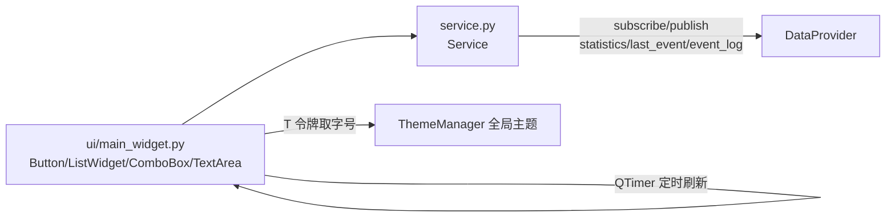

# SPEC：task_reporter UI 迁移至 InstructionX_UIKit

- **创建日期**：2026-07-29
- **修改日期**：2026-07-29

## 1. 技术方案与设计决策（Why）

| 决策 | 理由 |
|---|---|
| 整体删除插件 QSS（`style/main.qss`）与样式加载样板 | UIKit 组件默认样式 + 全局 `build_qss` 已覆盖全部控件样式并自动跟随亮/暗主题，插件级 QSS 冗余 |
| 删除 `get_widget` 主题缓存覆写 | 该覆写仅为 QSS 主题切换重建 widget；UIKit 全局主题切换经 `ThemeManager` 自动生效，无需插件干预 |
| 标题用 `QFont` + `T("font.lg")` 而非 QSS | 禁止硬编码字号；令牌随主题实时生效 |
| 主操作「订阅」「生成报告」用 `Button(variant="primary")`，「清除历史」用 `variant="danger"` | UIKit 语义：主操作 primary、破坏性操作 danger |
| `QMessageBox.question` → `Dialog.confirm`（非阻塞 + 回调） | 以 components/dialog.py 源码为准：`confirm(parent, title, text, on_result)` 经 `finished` 信号回调结果 |
| `QInputDialog.getText` → `Dialog` + `LineEdit` + `exec()` | dialog.py 无文本输入静态方法，以 `Dialog.set_content(LineEdit)` 组合实现，`QDialog.exec()` 取确认结果 |
| 结果告知 → `Message.info/warning(self, text)` | 轻提示非阻塞、自动消失，替代模态 QMessageBox；原 critical 降级为 warning 轻提示 |
| 占位提示文案提取为模块常量 | 原代码多处重复硬编码同一字符串，提常量消除魔法字符串，取值不变 |
| 版本号 release.1.0.0 → release.1.1.0 | UI 重构属功能层面改进，升级小版本 |

## 2. 控件映射

| 原控件 | 新控件 |
|---|---|
| `QPushButton`（订阅/生成报告） | `Button(..., variant="primary")` |
| `QPushButton`（取消订阅/刷新统计/刷新事件） | `Button(..., variant="default")` |
| `QPushButton`（清除历史） | `Button(..., variant="danger")` |
| `QListWidget`（管理器 ID、事件历史） | `ListWidget`（UIKit 统一行高代理） |
| `QComboBox`（报告格式） | `ComboBox(["json", "txt", "html"])` |
| `QTextEdit`（统计展示，只读） | `TextArea()` + `setReadOnly(True)` |
| `QMessageBox.information/warning/critical` | `Message.info/warning(self, text)` |
| `QMessageBox.question`（清除确认） | `Dialog.confirm(..., on_result=self._on_clear_confirmed)` |
| `QInputDialog.getText`（修改 ID） | `Dialog` + `LineEdit`，`exec()` 确认 |
| `QLabel` 标题（QSS heading） | `QLabel` + `QFont(T("font.lg"), Bold)` |

## 3. 数据流向

## 4. 涉及修改的文件

- `ui/main_widget.py`：UIKit 迁移（删除样式加载样板，`import json` 置顶，占位提示提为常量）；
- `entrance.py`：删除函数级 `utils.style_qss` 导入与 `get_widget` 主题缓存覆写；
- `information.py` / `IXPlugin.json`：version → `release.1.1.0`；IXPlugin.json 重写为 UTF-8 简洁中文 description；
- 删除：`style/` 目录、`__pycache__`。

## 5. 验证

项目根运行 `.venv\Scripts\python.exe temp\verify_batch1.py task_reporter`（离屏实例化主控件 + 亮/暗主题切换各一次）必须 PASS。
