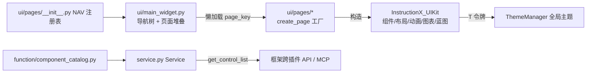
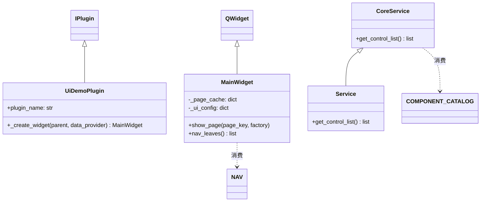

# SPEC：ui_demo 插件重写为 InstructionX_UIKit 组件橱窗

- **创建日期**：2026-07-29
- **修改日期**：2026-07-29

## 1. 技术方案与设计决策（Why）

| 决策 | 理由 |
|---|---|
| 演示页整体移植 UIKit 仓库 `demo/pages/`（14 个文件，仅修正 `ChartView` 笔误为 `ChartWidget`） | 用户指定以该 Demo 为基准；pages 内部全部相对导入 + 绝对导入 `InstructionX_UIKit`，零 `demo` 包耦合，可原样移植；保持可比对性便于后续同步 |
| 主控件重写（`ui/main_widget.py`）而非移植 `demo/main_window.py` | Demo 主窗口含 QApplication/ThemeManager.apply/顶部条/主题切换，均属应用层职责，框架已有全局主题入口（`ui/uikit_theme.py`），插件重复实现会违反「全局主题唯一入口」约定 |
| `get_control_list()` 数据放 `function/component_catalog.py`（纯数据，镜像 NAV 标题） | 规范要求 function/ 不依赖 PySide6，而 NAV 所在的 `ui/pages/__init__.py` 会牵入全部 UI 模块；Service 自动注册在插件加载期实例化，不应承担重型 UI 导入 |
| 布局参数入 `config/default.json`（ui 段），代码内置同值兜底 | 禁止魔法数；配置缺失/损坏时插件仍可用 |
| 版本号 release.1.0.0 → release.2.0.0 | 整体重写、service_api 返回内容语义变化，主版本升级 |

## 2. 目录结构与模块划分

```
plugin/ui_demo/
├── IXPlugin.json            # 描述文件（release.2.0.0）
├── entrance.py              # 胶水层：UiDemoPlugin(IPlugin)
├── information.py           # 元数据：UiDemoPluginInfo(IPluginInfo)
├── service.py               # 接口层：Service(CoreService)，无参可实例化
├── config/default.json      # 布局参数（导航树宽度/缩进）
├── function/
│   ├── component_catalog.py # 组件橱窗目录（纯数据，镜像 NAV）
│   └── services/core_service.py  # CoreService.get_control_list()
└── ui/
    ├── main_widget.py       # MainWidget：导航树 + QStackedWidget 懒加载
    └── pages/               # 移植自 UIKit 仓库 demo/pages（14 个文件）
        ├── __init__.py      # NAV/USAGE 注册表（修正 ChartView 笔误）
        ├── common.py        # make_page/Section/row/col 脚手架
        ├── tokens.py layouts.py layout_samples.py inputs.py display.py
        ├── feedback.py anim_property.py anim_painted.py basic_widgets.py
        ├── charts.py blueprint.py playground.py
```

## 3. 数据流向



## 4. 类与接口关系



## 5. 状态机设计

本插件为数据驱动（导航选择 → 页面懒加载缓存），无多状态转换，不需要状态机。

## 6. 涉及修改的描述文件与配置项

- `IXPlugin.json`：version `release.2.0.0`、description、keywords；
- `information.py`：version/description/skill_description/service_api/tags；
- `config/default.json`：`ui.nav_min_width/nav_max_width/nav_default_width/nav_indent`；
- 删除：`style/`（空目录）、旧 `ui/main_widget.py`（678 行原生控件演示）。

## 7. 与 UIKit 仓库 Demo 的差异清单（移植时的全部有意改动）

1. 不移植 `demo/main_window.py` 与 `demo/__init__.py`、`main.py`（应用层职责）；
2. 修正 `pages/__init__.py` USAGE 中 `ChartView` 笔误为 `ChartWidget`；
3. 新增 `ui/main_widget.py`（QWidget 版导航 + 堆叠，参数取自 config）；
4. 其余 `pages/` 文件与原仓库逐字节一致（除换行符）。
