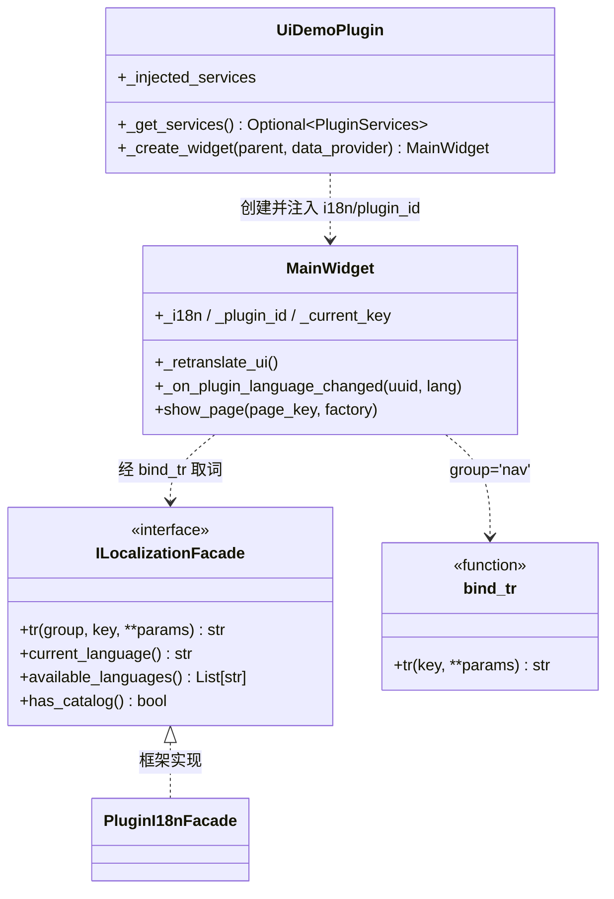

# SPEC：ui_demo 插件多国语言（i18n）适配技术方案

- **创建日期**：2026-08-22
- **修改日期**：2026-08-22（增补 §1.5 引脚名固定中文决策）

## 1. 技术方案与设计决策（Why）

### 1.1 取词入口：`bind_tr` 闭包（common.py）

页面模块以工厂函数（`create_page`）组织而非类，无法挂 `_tr` 方法。
在 `ui/pages/common.py` 新增：

```python
def bind_tr(i18n, group):
    def tr(key, /, **params):
        if i18n is None:
            return key          # 门面未注入时优雅降级返回键名
        return i18n.tr(group, key, **params)
    return tr
```

每个页面工厂开头 `tr = bind_tr(i18n, "<本页分组>")`，页内全部文案以
`tr("...")` 取词。**Why**：一个分组对应一个页面模块，调用点只剩键名，
改动面最小；降级语义与框架「插件无语言包时返回键名」一致。

### 1.2 语言切换刷新：重建页面而非逐控件重设

框架不替插件重绘 UI。ui_demo 有 80+ 演示页、每页数十个文案控件，
逐控件 `_retranslate_ui` 成本与遗漏风险都不可接受。采用**重建式刷新**：

- MainWidget 缓存当前页键 `_current_key`；
- `_retranslate_ui()`：重设导航树全部节点文案 → 清空 `_page_cache`
  （`removeWidget` + `deleteLater`）→ 重新选中 `_current_key`，
  页面经懒加载以新语言重建；
- 页面内全部是「构建期取词」，重建即完成刷新，页面类无需各自实现刷新。

**Why**：演示页为纯展示内容，重建代价低（懒加载本来就按需构建）；
该方式被任务规范明确允许（「对刷新代价过高的页面，允许重建该页内容」）。

### 1.3 信号接入

MainWidget 构造时（仅当 `i18n` 非 None）：

```python
get_language_manager().language_changed.connect(self._retranslate_ui)
get_language_manager().plugin_language_changed.connect(self._on_plugin_language_changed)
```

`plugin_language_changed` 回调先比对 `plugin_id != self._plugin_id` 再刷新。

### 1.4 NAV 注册表：标题字面量改为键

`ui/pages/__init__.py` 的 `NAV` 原结构 `(cat_key, cat_title, [(page_key, page_title, factory)])`
改为 `(cat_key, [(page_key, factory)])`，标题由 MainWidget 以派生键取词：
分类 `nav:cat.<cat_key>`、页面 `nav:page.<page_key>`。
**Why**：标题单一来源收敛到语言文件，消除 NAV 与 component_catalog 的重复字面量。

### 1.5 蓝图页节点元数据：注册期取词

`register_demo_node_types()` 原在**模块 import 时**以中文字面量注册节点类型
（类型名/分类/描述/引脚名）。改为 `register_demo_node_types(tr)`——
仅类型名/分类/描述取词，引脚名保持固定中文（见下）：

- 注册时机从模块级移到 `create_page` 内（建画布前）；owner 命名空间
  （`REGISTRY_OWNER="ui-demo"`）保证重复注册为同空间覆盖，语言切换重建页面时
  以新语言重新注册即完成刷新；
- **引脚名为节点定义的内部标识，固定中文原名（"进入"/"退出"/"图像"/"张量" 等）
  不参与翻译**：UIKit `NodeRegistry.register` 的 `_same_definition` 以
  inputs/outputs 引脚定义（PinSpec 相等性含 name）比对判定重复注册——
  引脚名若随语言变化，语言切换重注册时引脚定义不同，触发「重复注册且引脚
  定义不同，旧定义已被覆盖」WARNING。引脚名固定后，重注册为静默幂等覆盖，
  而节点 title/category/description/body 标签仍随语言刷新；
- 节点体 `body_builder`（宽/高/插值等行内标签）改为捕获 `tr` 的闭包工厂；
- `PROPERTY_SCHEMAS` 第 3 元素由中文标签改为**标签键**，右侧属性面板渲染时经
  页面 `tr` 取词（面板随页面重建而刷新）。

**Why**：节点类型注册表存的是字符串，无法事后翻译；在注册边界取词是侵入最小
且唯一正确的位置。模块级注册调用被移除——注册的唯一消费者是本页画布，
`register_demo_node_types` 仍导出供测试调用（签名加默认参数 `tr=None`，
None 时注册键名，与全局降级语义一致）。

### 1.6 不翻译的内容（明确边界）

- `pages/__init__.py` 的 `USAGE` 与 `layout_samples.USAGE`：最小调用**代码示例**，
  代码即文档，不翻译；
- `function/component_catalog.py` 与 `get_control_list()`：跨插件 API / MCP 工具的
  数据契约，返回内容保持稳定（中文），不随界面语言变化；
- 图表 option 中的技术枚举值（`"polygon"`、`"bilinear"` 等）、文件路径、
  颜色值、日期时间字符串；
- 蓝图节点**引脚名**（"进入"/"退出"/"图像"/"张量" 等）：节点定义的内部标识，
  固定中文原名不参与翻译（原因见 §1.5）；
- 代码注释与 docstring（保持中文）。

### 1.7 依赖方向

UI 层（ui/）取词只依赖 `core.interfaces.ILocalizationFacade` 抽象与
`common.bind_tr`；`function/` 不引入 i18n（catalog 为 API 契约，见 1.6）。
`get_language_manager()` 仅在 MainWidget（UI 层）使用。

## 2. 目录结构与模块划分

```
plugin/ui_demo/
  text/
    zh.xml                 # 默认/回退终点语言（完整）
    en.xml                 # 英文（键集合与 zh 完全一致）
  entrance.py              # +__init__(services=None) / _get_services()；注入 i18n 与 plugin_id
  ui/
    main_widget.py         # +i18n/plugin_id 参数；导航取词；语言信号 → 重建式刷新
    pages/
      common.py            # +bind_tr()；usage_section/DemoCard 接 i18n
      playground.py        # PlaygroundPanel/ParamCard +i18n（面板默认标题/重置/播放）
      __init__.py          # NAV 去标题字面量；_with_usage 透传 i18n
      tokens.py layouts.py layout_samples.py basic_widgets.py inputs.py
      display.py feedback.py anim_property.py anim_painted.py charts.py
      blueprint.py         # 各 create_page(i18n=None)，页内 bind_tr 取词
  IXPlugin.json            # name/description 多语言字典
```

## 3. 数据流向

```mermaid
flowchart LR
    FW[框架 PluginManager] -->|构造注入 PluginServices| EN[entrance.UiDemoPlugin]
    EN -->|_get_services().localization + plugin_id| MW[ui.main_widget.MainWidget]
    MW -->|bind_tr(i18n, 'nav')| NAVXML[(text/zh.xml · en.xml<br>group: nav)]
    MW -->|factory(i18n) 懒加载| PG[ui/pages/* 演示页]
    PG -->|bind_tr(i18n, group)| XML[(text/zh.xml · en.xml<br>各页面分组)]
    LM[core.i18n.LanguageManager] -->|language_changed| MW
    LM -->|plugin_language_changed(uuid, lang)| MW
    MW -->|_retranslate_ui: 重设导航 + 清缓存重建当前页| PG
```

## 4. 类与接口关系



## 5. 涉及修改的描述文件与配置项

| 文件 | 修改内容 |
|---|---|
| `IXPlugin.json` | `name`/`description` → `{"zh": ..., "en": ...}`；其余字段不动 |
| `text/zh.xml`、`text/en.xml` | 新增；`language` 属性与文件名一致 |
| `information.py` | 不修改（版本保持 release.1.0.3） |
| `config/default.json` | 不修改（布局参数，无文案） |
| `function/component_catalog.py` | 不修改（API 数据契约，见 §1.6） |

## 6. 分组 / 键命名约定

- **分组 = 页面模块名**（一个页面模块一个 group）：
  `nav`（导航树）、`common`（公共脚手架）、`playground`（参数面板）、
  `tokens`、`layouts`、`layout_samples`、`basic_widgets`、`inputs`、
  `display`、`feedback`、`anim_property`、`anim_painted`、`charts`、`blueprint`；
- **键名点分、自解释**：
  - 导航：`cat.<分类键>` / `page.<页面键>`（页面键即 NAV 注册键，如 `page.button`）；
  - 页面：`title` / `desc` / `section.<名>` / 组件页 `<组件键>.<位>`（如 `inputs` 组内
    `button.variant.primary`、`display` 组内 `table.header.name`）；
  - 图表数据：`data.<语义>`（如 `data.month.1`、`data.city.beijing`、`data.series.sales`）；
  - 蓝图：`node.<类型>.name|desc`、`node.cat.<分类>`、`pin.<引脚>`、`prop.<属性>`、
    `status.<状态>`、`toolbar.<按钮>`；
  - 参数规格标签：`<卡片/参数语义>.<参数key>`（如 `fade_in.duration`）；
- **占位符仅命名式**：如 `status.running = 运行中 {cur}/{total} …`，
  调用 `tr("status.running", cur=..., total=...)`；禁止 `{0}` 位置式；
- 两语言文件 group 与 key 集合必须完全一致（`scripts/check_i18n_completeness.py`
  以 zh.xml 为参照校验 en.xml）。
