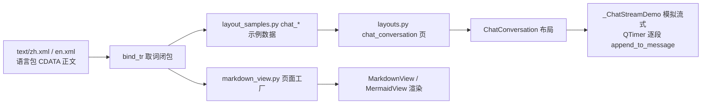

# SPEC：ui_demo 补齐 UIKit alpha-v1.0.2 新能力演示页

- 创建日期：2026-08-25
- 修改日期：2026-08-25

对应 PRD：`PRD-uikit-alpha-v102-pages-20260825.md`

## 技术方案与设计决策

### 决策 1：MarkdownView 页独立成模块 `ui/pages/markdown_view.py`

`display.py` 已有 18 个组件页工厂（约 500 行），MarkdownView 页含流式播放
逻辑与多段示例正文，继续塞入会加剧臃肿。新页独立模块、独立语言分组
`markdown_view`，在 `display.py` 的 `DISPLAY_PAGES` 末尾登记（保持
「组件 · 展示」分类归属与导航顺序）。

### 决策 2：示例正文（Markdown / 对话消息）入语言包，CDATA 原样保留

插件规范要求全部用户可见文案经 i18n 取词。Markdown 示例正文含换行与
`{...}`（mermaid 判定节点）等特殊字符：

- 语言文件以 `<![CDATA[...]]>` 承载多行正文，加载器
  `core/i18n/loader.py::_extract_text` 经 `itertext` 兼容 CDATA，
  首尾空白剥离、内部换行保留；
- 含 `{...}` 的正文一律以**无参数** `tr(key)` 取词——
  `fallback.py::format_template` 在无参数时直接返回模板，不触发
  `str.format`，mermaid 的 `B{校验}` 等写法安全；
- en.xml 提供对应英文译文（mermaid 节点标签同步英文化）。

### 决策 3：chat_conversation 页复用布局页既有脚手架

插件 `layouts.py` 的 `_LAYOUTS` / `_make` / `_embed` 模式直接扩展：
新增 `_build_chat_conversation(tr)` 工厂与 `("chat_conversation", ..., 560)`
注册项。与上游 demo 的差异：操作条的删除 / 编辑 / 提交等信号除驱动
模拟流式行为外，同时更新页内「最近操作」状态提示行（PRD F2 要求），
故工厂返回「对话布局 + 状态行」的包裹控件。

流式模拟以 `_ChatStreamDemo` 控制器类承载（QTimer 逐段追加），避免
工厂函数超过 20 行硬性限制；控制器实例挂在包裹控件上防 GC。

### 决策 4：蓝图页后端状态行经 `gl_available()` 取词展示

`InstructionX_UIKit.blueprint.viewport` 导出 `gl_available()`
（模块级缓存，QApplication 存在后探测一次），与 `create_viewport`
的实际选择一致。蓝图页 `__init__` 在工具条下方加一行
`hint_label`，文案 `backend.label`（含 `{backend}` 占位）+
`backend.gl` / `backend.software` 两键。

### 决策 5：MermaidView 不单独立页

MarkdownView 页的 mermaid 分区已完整覆盖交互查看器（叠加层），
另加「MermaidView 独立使用」小节演示脱离 MarkdownView 的直接实例化
场景即可，不为 MermaidView 单设导航页（它不属 58 组件口径）。

## 目录结构与模块划分

| 文件 | 变更 |
|------|------|
| `ui/pages/markdown_view.py` | 新增：MarkdownView 演示页（分组 `markdown_view`） |
| `ui/pages/display.py` | `DISPLAY_PAGES` 末尾登记 `markdown_view` 页 |
| `ui/pages/layouts.py` | 新增 `chat_conversation` 页工厂与注册（第 13 布局） |
| `ui/pages/layout_samples.py` | 新增 `chat_messages/chat_stream_reply/chat_stream_continue` 示例数据函数与 `USAGE["chat_conversation"]` |
| `ui/pages/__init__.py` | `USAGE` 表新增 `markdown_view` 单行示例 |
| `ui/pages/blueprint.py` | 工具条下新增渲染后端状态行 |
| `function/component_catalog.py` | 展示分类 +「MarkdownView Markdown 渲染」，布局分类 +「流式对话」 |
| `IXPlugin.json` / `information.py` | 描述口径 57/12 → 58/13 |
| `text/zh.xml` / `text/en.xml` | 新增键（见下） |

## 数据流向

## 语言键设计（zh + en 同步）

- `nav`：`page.markdown_view`、`page.chat_conversation`
- `markdown_view`（新分组）：`title` / `desc` / `sec.basic` / `sec.math` /
  `sec.mermaid` / `sec.mermaid_view` / `sec.stream` / `sec.empty` /
  `replay` / `hint.mermaid` / `hint.mermaid_view` /
  `sample.basic` / `sample.math` / `sample.mermaid` / `sample.stream` /
  `sample.standalone`（CDATA 正文）
- `layouts`：`chat_conversation.title` / `chat_conversation.desc`
- `layout_samples`：`chat.info` / `chat.user.1..5` / `chat.assistant.1..5` /
  `chat.stream_reply` / `chat.stream_continue` / `chat.status.ready` /
  `chat.status.submitted` / `chat.status.deleted` / `chat.status.edited` /
  `chat.status.regenerate` / `chat.status.continue`
- `blueprint`：`backend.label` / `backend.gl` / `backend.software`

## 验证方案

- 临时冒烟脚本 `temp/smoke_ui_demo_v102_pages.py`（`QT_QPA_PLATFORM=offscreen`
  + `QT_QPA_FONTDIR`）：构建 MainWidget（注入以 zh.xml 为数据源的测试取词
  门面），遍历 NAV 逐页创建断言无异常；MarkdownView 页与 chat_conversation
  页 `grab()` 截图非空白（processEvents 推进异步公式渲染与流式定时器）；
  蓝图页断言后端状态行在 offscreen 下显示软件渲染；
- `scripts/check_i18n_completeness.py --plugin-root plugin` 通过；
- 自查：新增 `tr()` 键在 zh.xml 全覆盖，zh/en 键集合一致。
