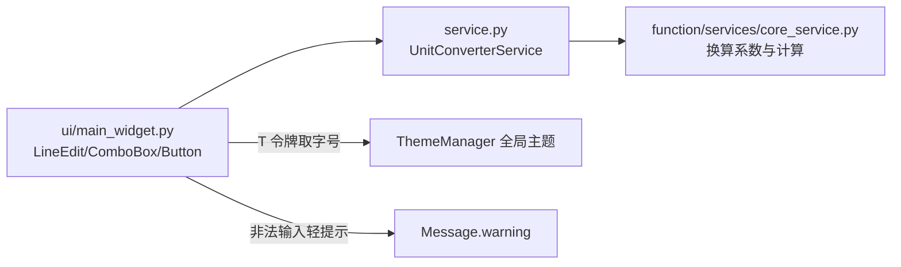

# SPEC：unit_converter UI 迁移至 InstructionX_UIKit

- **创建日期**：2026-07-29
- **修改日期**：2026-07-29

## 1. 技术方案与设计决策（Why）

| 决策 | 理由 |
|---|---|
| 整体删除插件 QSS（`style/style.qss`） | 仅含 `#resultValue` 一条规则，UIKit 全局 `build_qss` + `T()` 令牌已可覆盖且自动跟随亮/暗主题 |
| 标题/结果标签用 `QFont` + `T("font.lg")` 而非 QSS | 禁止硬编码字号；令牌随主题实时生效 |
| `Button(variant="primary")` 承载主操作「转换」 | UIKit 语义：主操作使用 primary 变体 |
| `Message.warning` 替代 `QMessageBox.warning` | 数值校验属轻提示，非阻塞自动消失，不打断用户输入流 |
| 转换组定义收敛为 `_GROUP_SPECS` 常量 + 方法名分发 | 消除原 if-elif 属性赋值分支，ui/ 只负责组装与信号转发 |
| 版本号 release.1.0.0 → release.1.1.0 | UI 重构属功能层面改进，升级小版本 |

## 2. 控件映射

| 原控件 | 新控件 |
|---|---|
| `QLineEdit`（数值输入） | `LineEdit(placeholder="请输入数值", clearable=True)` |
| `QComboBox`（从/到单位） | `ComboBox(units)` |
| `QPushButton("转换")` | `Button("转换", variant="primary")` |
| `QLabel` 标题（QSS heading） | `QLabel` + `QFont(T("font.lg"), Bold)` |
| `QLabel` 结果（QSS `#resultValue`） | `QLabel` + `QFont(T("font.lg"), Bold)` |
| `QMessageBox.warning` | `Message.warning(self, "请输入有效的数值！")` |

## 3. 数据流向

## 4. 涉及修改的文件

- `ui/main_widget.py`：UIKit 迁移（删除样式加载样板，重写控件组装）；
- `information.py` / `IXPlugin.json`：version → `release.1.1.0`；IXPlugin.json 乱码 description 重写；
- 删除：`style/` 目录、全部 `__pycache__`；
- 未改动：`service.py`、`function/services/core_service.py`、`config/default.json`、`entrance.py`。

## 5. 验证

`temp/verify_batch1.py unit_converter` 离屏验证插件导入、控件创建与亮/暗主题切换；另冒烟调用 `length_converter`/`weight_converter`/`temperature_converter` 确认业务逻辑未破坏。
